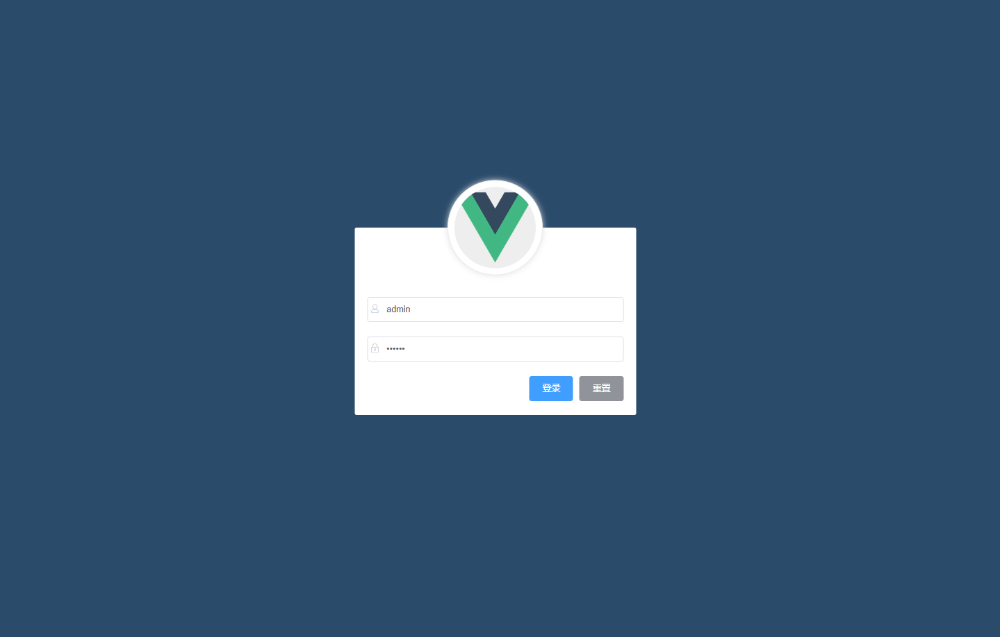
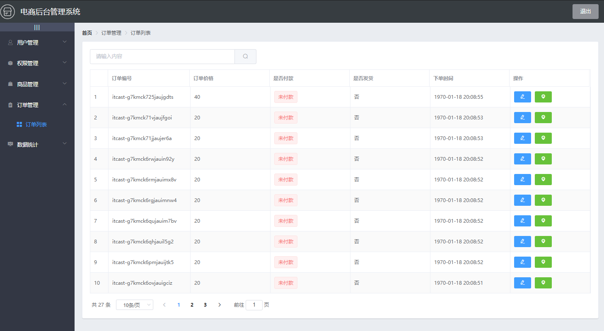

# Vue-Shop-Management-System

//本项目预览地址：http://59.110.64.140/shop/
//（可以在我的阿里云上预览该项目 初始用户和密码都为admin）

不好意思阿里云没续费过期了QAQ，不过网站效果跟教程是一摸一样的不用担心(*^_^*)

## 项目简介


电商管理系统，使用vue+elementUI，实现的功能有
* 用户管理
* 权限管理
* 分类管理
* 参数管理
* 商品管理
* 数据统计
仓库内容包含【源代码+个人总结笔记+参考资料】

## 界面预览






### 仓库内容

| 文件夹              | 内容                      | 备注               |
| ------------------- | ------------------------- | ------------------ |
| Vue电商-笔记和文档  | Vue实战项目：电商管理系统 | 项目笔记           |
|                     | api接口文档.md            | 项目使用的接口文档 |
| Vue电商-参考讲义PPT |                           | 项目讲义（PPT）    |

### 视频地址

20-Vue实战项目：电商管理系统（Element-UI）

https://www.bilibili.com/video/BV1EE411B7SU?from=search&seid=12483849486304322239

## 如何使用该项目
### 安装依赖
```
npm install
```
### 开发时用到的编译和热加载（启动项目）
```
npm run serve
```
### 生成生产版本（这里生成的dist文件可以部署到服务器上来直接访问）
```
npm run build
```
