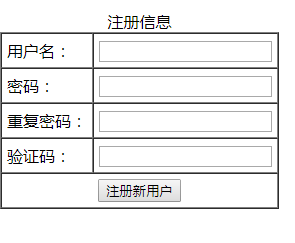
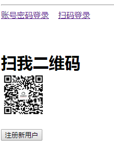

# 编写一个路由页面

## 步骤

1.拿到老师提供的基本结构页面，在myRouter.html页面中编写代码实现效果。

2.在app中添加两个路由连接和一个路由占位符，用来摆放注册和登录的路由组件

​	路由链接参考代码：

```
  <router-link to="/register">注册</router-link>

  <router-link to="/login">登录</router-link>

```

​	路由占位符参考代码：

```
  <router-view></router-view>
```

3.创建注册路由组件结构，效果如下图：



表格结构参考代码：

```
<table border="1" cellspacing="0" cellpadding="5">
  <caption>注册信息</caption>
  <tr>
    <td> 用户名： </td>
    <td> <input type="text"> </td>
  </tr>
  <tr>
    <td> 密码： </td>
    <td> <input type="text"> </td>
  </tr>
  <tr>
    <td> 重复密码： </td>
    <td> <input type="text"> </td>
  </tr>
  <tr>
    <td> 验证码： </td>
    <td> <input type="text"> </td>
  </tr>
  <tr>
  	<td colspan="2" align="center"> <input type="button" value="注册新用户" > </td>
  </tr>
</table>
```


4.创建登录路由组件结构，效果如下图：


登录结构参考代码：

```
<h1>请选择登录方式</h1>
```


5.创建路由对象，设置注册路由规则以及登录路由规则

路由对象和一级路由规则参考代码：

```
var myRouter = new VueRouter({
  //routes是路由规则数组
  routes: [
    { path:"/",redirect:"/login"},
    //每一个路由规则都是一个对象，对象中至少包含path和component两个属性
    //path表示  路由匹配的hash地址，component表示路由规则对应要展示的组件对象
    { path: "/register", component: Register },
    { path: "/login", component: Login}
  ]
})
```


6.将路由对象挂载到Vue实例

挂载路由对象参考代码：

```
var vm = new Vue({
  el: '#app',
  data: {},
  methods: {},
  router:myRouter
});
```


7.更改登录路由组件结构，添加两个子级路由连接以及子级路由占位符

登录组件更改代码参考：

```
var Login = { 
			template: `<div>
            <h1>请选择登录方式</h1>
            <hr>
            <router-link to="/login/account">账号密码登录</router-link> &nbsp;&nbsp;
            <router-link to="/login/phone">扫码登录</router-link>
            <!-- 子路由组件将会在router-view中显示 -->
            <br><br><br>
            <router-view></router-view>
            </div>` 
}
```


8.创建两个子级路由组件(账号密码登录组件，手机扫码登录组件)，效果如下图：




子级路由组件参考代码：

```
var account = { 
  template:"<div>账号：<input><br>密码：<input><br><button>登录</button><button>注册新用户</button></div>"
};
var phone = { 
  template:"<h1><div>扫我二维码</div><br><button>注册新用户</button></h1>"
};
```


9.为登录路由规则添加子级路由规则

添加子级路由规则参考代码：

```
var myRouter = new VueRouter({
//routes是路由规则数组
  routes: [
    
    //每一个路由规则都是一个对象，对象中至少包含path和component两个属性
    //path表示  路由匹配的hash地址，component表示路由规则对应要展示的组件对象
    { path: "/register", component: Register },
    { 
      path: "/login", 
      component: Login,
      //通过children属性为/login添加子路由规则
      children:[
        { path: "/login/account", component: account },
        { path: "/login/phone", component: phone },
      ]
    }
  ]
})
```


10.将注册路由添加设置为默认重定向地址

设置默认重定向参考代码：

```
{ path:"/",redirect:"/register"},
```

11.当点击账号密码登录，扫码登录中的注册新用户按钮时，使用编程式导航跳转到注册组件

编程式导航参考代码：

```
var account = {
            template: "<div>账号：<input><br>密码：<input><br><button>登录</button><button @click='toReg'>注册新用户</button></div>",
            methods:{
                toReg(){
                    this.$router.push("/register");
                }
            }
        };
var phone = {
            template: "<h1><div>扫我二维码</div><br><button @click='toReg'>注册新用户</button></h1>",
            methods:{
                toReg(){
                    this.$router.push("/register");
                }
            }
        };
```

