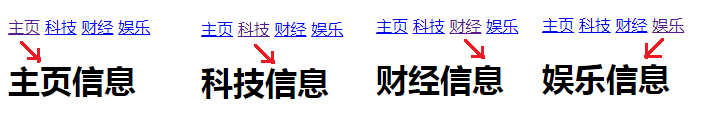
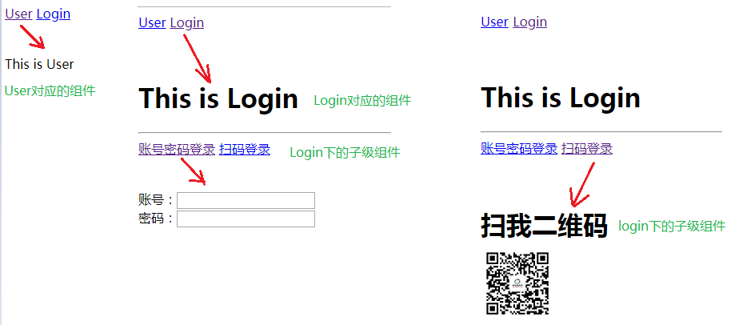

###今日目标
1.能够说出什么是路由 
2.能够说出前端路由的实现原理
3.能够使用Vue-Router实现前端路由
4.能够实现嵌套路由，动态路由  
5.能够实现命名路由以及编程式导航 
6.理解并实现后台管理案例


###1.路由的概念
路由的本质就是一种对应关系，比如说我们在url地址中输入我们要访问的url地址之后，浏览器要去请求这个url地址对应的资源。
那么url地址和真实的资源之间就有一种对应的关系，就是路由。

路由分为前端路由和后端路由
1).后端路由是由服务器端进行实现，并完成资源的分发
2).前端路由是依靠hash值(锚链接)的变化进行实现 

后端路由性能相对前端路由来说较低，所以，我们接下来主要学习的是前端路由
前端路由的基本概念：根据不同的事件来显示不同的页面内容，即事件与事件处理函数之间的对应关系
前端路由主要做的事情就是监听事件并分发执行事件处理函数

###2.前端路由的初体验
前端路由是基于hash值的变化进行实现的（比如点击页面中的菜单或者按钮改变URL的hash值，根据hash值的变化来控制组件的切换）
核心实现依靠一个事件，即监听hash值变化的事件
```
window.onhashchange = function(){
    //location.hash可以获取到最新的hash值
    location.hash
}
```

前端路由实现tab栏切换：
```
    <!DOCTYPE html>
    <html lang="en">
    <head>
        <meta charset="UTF-8" />
        <meta name="viewport" content="width=device-width, initial-scale=1.0" />
        <meta http-equiv="X-UA-Compatible" content="ie=edge" />
        <title>Document</title>
        <!-- 导入 vue 文件 -->
        <script src="./lib/vue_2.5.22.js"></script>
    </head>
    <body>
        <!-- 被 vue 实例控制的 div 区域 -->
        <div id="app">
        <!-- 切换组件的超链接 -->
        <a href="#/zhuye">主页</a> 
        <a href="#/keji">科技</a> 
        <a href="#/caijing">财经</a>
        <a href="#/yule">娱乐</a>

        <!-- 根据 :is 属性指定的组件名称，把对应的组件渲染到 component 标签所在的位置 -->
        <!-- 可以把 component 标签当做是【组件的占位符】 -->
        <component :is="comName"></component>
        </div>

        <script>
        // #region 定义需要被切换的 4 个组件
        // 主页组件
        const zhuye = {
            template: '<h1>主页信息</h1>'
        }

        // 科技组件
        const keji = {
            template: '<h1>科技信息</h1>'
        }

        // 财经组件
        const caijing = {
            template: '<h1>财经信息</h1>'
        }

        // 娱乐组件
        const yule = {
            template: '<h1>娱乐信息</h1>'
        }
        // #endregion

        // #region vue 实例对象
        const vm = new Vue({
            el: '#app',
            data: {
            comName: 'zhuye'
            },
            // 注册私有组件
            components: {
            zhuye,
            keji,
            caijing,
            yule
            }
        })
        // #endregion

        // 监听 window 的 onhashchange 事件，根据获取到的最新的 hash 值，切换要显示的组件的名称
        window.onhashchange = function() {
            // 通过 location.hash 获取到最新的 hash 值
            console.log(location.hash);
            switch(location.hash.slice(1)){
            case '/zhuye':
                vm.comName = 'zhuye'
            break
            case '/keji':
                vm.comName = 'keji'
            break
            case '/caijing':
                vm.comName = 'caijing'
            break
            case '/yule':
                vm.comName = 'yule'
            break
            }
        }
        </script>
    </body>
    </html>
```
案例效果图：


点击每个超链接之后，会进行相应的内容切换，如下：




核心思路：
在页面中有一个vue实例对象，vue实例对象中有四个组件，分别是tab栏切换需要显示的组件内容
在页面中有四个超链接，如下：

```
<a href="#/zhuye">主页</a> 
<a href="#/keji">科技</a> 
<a href="#/caijing">财经</a>
<a href="#/yule">娱乐</a>
```
当我们点击这些超链接的时候，就会改变url地址中的hash值，当hash值被改变时，就会触发onhashchange事件
在触发onhashchange事件的时候，我们根据hash值来让不同的组件进行显示：
```
window.onhashchange = function() {
    // 通过 location.hash 获取到最新的 hash 值
    console.log(location.hash);
    switch(location.hash.slice(1)){
        case '/zhuye':
        //通过更改数据comName来指定显示的组件
        //因为 <component :is="comName"></component> ，组件已经绑定了comName
        vm.comName = 'zhuye'
        break
        case '/keji':
        vm.comName = 'keji'
        break
        case '/caijing':
        vm.comName = 'caijing'
        break
        case '/yule':
        vm.comName = 'yule'
        break
    }
}
```

###3.Vue Router简介
它是一个Vue.js官方提供的路由管理器。是一个功能更加强大的前端路由器，推荐使用。
Vue Router和Vue.js非常契合，可以一起方便的实现SPA(single page web application,单页应用程序)应用程序的开发。
Vue Router依赖于Vue，所以需要先引入Vue，再引入Vue Router

Vue Router的特性：
支持H5历史模式或者hash模式
支持嵌套路由
支持路由参数
支持编程式路由
支持命名路由
支持路由导航守卫
支持路由过渡动画特效
支持路由懒加载
支持路由滚动行为

###4.Vue Router的使用步骤(★★★)
A.导入js文件
<script src="lib/vue_2.5.22.js"></script>
<script src="lib/vue-router_3.0.2.js"></script>
B.添加路由链接:<router-link>是路由中提供的标签，默认会被渲染为a标签，to属性默认被渲染为href属性，
to属性的值会被渲染为#开头的hash地址
<router-link to="/user">User</router-link>
<router-link to="/login">Login</router-link>
C.添加路由填充位（路由占位符）
<router-view></router-view>
D.定义路由组件
var User = { template:"<div>This is User</div>" }
var Login = { template:"<div>This is Login</div>" }
E.配置路由规则并创建路由实例
var myRouter = new VueRouter({
    //routes是路由规则数组
    routes:[
        //每一个路由规则都是一个对象，对象中至少包含path和component两个属性
        //path表示  路由匹配的hash地址，component表示路由规则对应要展示的组件对象
        {path:"/user",component:User},
        {path:"/login",component:Login}
    ]
})
F.将路由挂载到Vue实例中
new Vue({
    el:"#app",
    //通过router属性挂载路由对象
    router:myRouter
})

小结：
Vue Router的使用步骤还是比较清晰的，按照步骤一步一步就能完成路由操作
A.导入js文件
B.添加路由链接
C.添加路由占位符(最后路由展示的组件就会在占位符的位置显示)
D.定义路由组件
E.配置路由规则并创建路由实例
F.将路由挂载到Vue实例中

补充：
路由重定向：可以通过路由重定向为页面设置默认展示的组件
在路由规则中添加一条路由规则即可，如下：
var myRouter = new VueRouter({
    //routes是路由规则数组
    routes: [
        //path设置为/表示页面最初始的地址 / ,redirect表示要被重定向的新地址，设置为一个路由即可
        { path:"/",redirect:"/user"},
        { path: "/user", component: User },
        { path: "/login", component: Login }
    ]
})

###5.嵌套路由，动态路由的实现方式
####A.嵌套路由的概念(★★★)
当我们进行路由的时候显示的组件中还有新的子级路由链接以及内容。

嵌套路由最关键的代码在于理解子级路由的概念：
比如我们有一个/login的路由
那么/login下面还可以添加子级路由，如:
/login/account
/login/phone

参考代码如下：
```
var User = { template: "<div>This is User</div>" }
//Login组件中的模板代码里面包含了子级路由链接以及子级路由的占位符
    var Login = { template: `<div>
        <h1>This is Login</h1>
        <hr>
        <router-link to="/login/account">账号密码登录</router-link>
        <router-link to="/login/phone">扫码登录</router-link>
        <!-- 子路由组件将会在router-view中显示 -->
        <router-view></router-view>
        </div>` }

    //定义两个子级路由组件
    var account = { template:"<div>账号：<input><br>密码：<input></div>"};
    var phone = { template:"<h1>扫我二维码</h1>"};
    var myRouter = new VueRouter({
        //routes是路由规则数组
        routes: [
            { path:"/",redirect:"/user"},
            { path: "/user", component: User },
            { 
                path: "/login", 
                component: Login,
                //通过children属性为/login添加子路由规则
                children:[
                    { path: "/login/account", component: account },
                    { path: "/login/phone", component: phone },
                ]
            }
        ]
    })

    var vm = new Vue({
        el: '#app',
        data: {},
        methods: {},
        router:myRouter
    });
```

页面效果大致如下：



####B.动态路由匹配(★★★)

var User = { template:"<div>用户：{{$route.params.id}}</div>"}

var myRouter = new VueRouter({
    //routes是路由规则数组
    routes: [
        //通过/:参数名  的形式传递参数 
        { path: "/user/:id", component: User },
        
    ]
})

补充：
如果使用$route.params.id来获取路径传参的数据不够灵活。
1.我们可以通过props来接收参数
var User = { 
    props:["id"],
    template:"<div>用户：{{id}}</div>"
    }

var myRouter = new VueRouter({
    //routes是路由规则数组
    routes: [
        //通过/:参数名  的形式传递参数 
        //如果props设置为true，route.params将会被设置为组件属性
        { path: "/user/:id", component: User,props:true },
        
    ]
})

2.还有一种情况，我们可以将props设置为对象，那么就直接将对象的数据传递给
组件进行使用
var User = { 
    props:["username","pwd"],
    template:"<div>用户：{{username}}---{{pwd}}</div>"
    }

var myRouter = new VueRouter({
    //routes是路由规则数组
    routes: [
        //通过/:参数名  的形式传递参数 
        //如果props设置为对象，则传递的是对象中的数据给组件
        { path: "/user/:id", component: User,props:{username:"jack",pwd:123} },
        
    ]
})

3.如果想要获取传递的参数值还想要获取传递的对象数据，那么props应该设置为
函数形式。
var User = { 
    props:["username","pwd","id"],
    template:"<div>用户：{{id}} -> {{username}}---{{pwd}}</div>"
    }

var myRouter = new VueRouter({
    //routes是路由规则数组
    routes: [
        //通过/:参数名  的形式传递参数 
        //如果props设置为函数，则通过函数的第一个参数获取路由对象
        //并可以通过路由对象的params属性获取传递的参数
        //
        { path: "/user/:id", component: User,props:(route)=>{
            return {username:"jack",pwd:123,id:route.params.id}
            } 
        },
        
    ]
})


###7.命名路由以及编程式导航
####A.命名路由：给路由取别名
案例：

var myRouter = new VueRouter({
    //routes是路由规则数组
    routes: [
        //通过name属性为路由添加一个别名
        { path: "/user/:id", component: User, name:"user"},
        
    ]
})

//添加了别名之后，可以使用别名进行跳转
<router-link to="/user">User</router-link>
<router-link :to="{ name:'user' , params: {id:123} }">User</router-link>

//还可以编程式导航
myRouter.push( { name:'user' , params: {id:123} } )

####B.编程式导航(★★★)
页面导航的两种方式：
A.声明式导航：通过点击链接的方式实现的导航
B.编程式导航：调用js的api方法实现导航

Vue-Router中常见的导航方式：
this.$router.push("hash地址");
this.$router.push("/login");
this.$router.push({ name:'user' , params: {id:123} });
this.$router.push({ path:"/login" });
this.$router.push({ path:"/login",query:{username:"jack"} });

this.$router.go( n );//n为数字，参考history.go
this.$router.go( -1 );

###8.实现后台管理案例(★★★)

案例效果：


点击左侧的"用户管理","权限管理","商品管理","订单管理","系统设置"都会出现对应的组件并展示内容

其中"用户管理"组件展示的效果如上图所示，在用户管理区域中的详情链接也是可以点击的，点击之后将会显示用户详情信息。

案例思路：
1).先将素材文件夹中的11.基于vue-router的案例.html复制到我们自己的文件夹中。
看一下这个文件中的代码编写了一些什么内容，
这个页面已经把后台管理页面的基本布局实现了
2).在页面中引入vue，vue-router
3).创建Vue实例对象，准备开始编写代码实现功能
4).希望是通过组件的形式展示页面的主体内容，而不是写死页面结构，所以我们可以定义一个根组件：

```
//只需要把原本页面中的html代码设置为组件中的模板内容即可
const app = {
    template:`<div>
        <!-- 头部区域 -->
        <header class="header">传智后台管理系统</header>
        <!-- 中间主体区域 -->
        <div class="main">
          <!-- 左侧菜单栏 -->
          <div class="content left">
            <ul>
              <li>用户管理</li>
              <li>权限管理</li>
              <li>商品管理</li>
              <li>订单管理</li>
              <li>系统设置</li>
            </ul>
          </div>
          <!-- 右侧内容区域 -->
          <div class="content right">
            <div class="main-content">添加用户表单</div>
          </div>
        </div>
        <!-- 尾部区域 -->
        <footer class="footer">版权信息</footer>
      </div>`
  }
```
5).当我们访问页面的时候，默认需要展示刚刚创建的app根组件，我们可以
创建一个路由对象来完成这个事情,然后将路由挂载到Vue实例对象中即可
```
const myRouter = new VueRouter({
    routes:[
        {path:"/",component:app}
    ]
})

const vm = new Vue({
    el:"#app",
    data:{},
    methods:{},
    router:myRouter
})
```
补充：到此为止，基本的js代码都处理完毕了，我们还需要设置一个路由占位符
```
<body>
  <div id="app">
    <router-view></router-view>
  </div>
</body>
```
6).此时我们打开页面应该就可以得到一个VueRouter路由出来的根组件了
我们需要在这个根组件中继续路由实现其他的功能子组件
先让我们更改根组件中的模板：更改左侧li为子级路由链接，并在右侧内容区域添加子级组件占位符
```
const app = {
    template:`<div>
        ........
        <div class="main">
          <!-- 左侧菜单栏 -->
          <div class="content left">
            <ul>
              <!-- 注意：我们把所有li都修改为了路由链接 -->
              <li><router-link to="/users">用户管理</router-link></li>
              <li><router-link to="/accesses">权限管理</router-link></li>
              <li><router-link to="/goods">商品管理</router-link></li>
              <li><router-link to="/orders">订单管理</router-link></li>
              <li><router-link to="/systems">系统设置</router-link></li>
            </ul>
          </div>
          <!-- 右侧内容区域 -->
          <div class="content right">
            <div class="main-content">
                <!-- 在 -->
                <router-view></router-view> 
            </div>
          </div>
        </div>
        .......
      </div>`
  }
```
然后，我们要为子级路由创建并设置需要显示的子级组件
```
//建议创建的组件首字母大写，和其他内容区分
const Users = {template:`<div>
    <h3>用户管理</h3>
</div>`}
const Access = {template:`<div>
    <h3>权限管理</h3>
</div>`}
const Goods = {template:`<div>
    <h3>商品管理</h3>
</div>`}
const Orders = {template:`<div>
    <h3>订单管理</h3>
</div>`}
const Systems = {template:`<div>
    <h3>系统管理</h3>
</div>`}

//添加子组件的路由规则
const myRouter = new VueRouter({
    routes:[
        {path:"/",component:app , children:[
            { path:"/users",component:Users },
            { path:"/accesses",component:Access },
            { path:"/goods",component:Goods },
            { path:"/orders",component:Orders },
            { path:"/systems",component:Systems },
        ]}
    ]
})

const vm = new Vue({
    el:"#app",
    data:{},
    methods:{},
    router:myRouter
})
```

7).展示用户信息列表：
    A.为Users组件添加私有数据,并在模板中循环展示私有数据
    ​```
    const Users = {
    data(){
        return {
            userList:[
                {id:1,name:"zs",age:18},
                {id:2,name:"ls",age:19},
                {id:3,name:"wang",age:20},
                {id:4,name:"jack",age:21},
            ]
        }
    },
    template:`<div>
        <h3>用户管理</h3>
        <table>
            <thead>
                <tr>
                    <th>编号</th>
                    <th>姓名</th>
                    <th>年龄</th>
                    <th>操作</th>
                </tr>
            </thead>
            <tbody>
                <tr :key="item.id" v-for="item in userList">
                    <td>{{item.id}}</td>
                    <td>{{item.name}}</td>
                    <td>{{item.age}}</td>
                    <td><a href="javascript:;">详情</a></td>
                </tr>
            </tbody>
        </table>
    </div>`}
    ​```

8.当用户列表展示完毕之后，我们可以点击列表中的详情来显示用户详情信息，首先我们需要创建一个组件，用来展示详情信息
```
const UserInfo = {
    props:["id"],
    template:`<div>
      <h5>用户详情</h5>
      <p>查看 {{id}} 号用户信息</p>
      <button @click="goBack">返回用户详情页</button>
    </div> `,
    methods:{
      goBack(){
        //当用户点击按钮，后退一页
        this.$router.go(-1);
      }
    }
  }
```
然后我们需要设置这个组件的路由规则
```
const myRouter = new VueRouter({
    routes:[
        {path:"/",component:app , children:[
            { path:"/users",component:Users },
            //添加一个/userinfo的路由规则
            { path:"/userinfo/:id",component:UserInfo,props:true},
            { path:"/accesses",component:Access },
            { path:"/goods",component:Goods },
            { path:"/orders",component:Orders },
            { path:"/systems",component:Systems },
        ]}
    ]
})

const vm = new Vue({
    el:"#app",
    data:{},
    methods:{},
    router:myRouter
})
```
再接着给用户列表中的详情a连接添加事件
```
const Users = {
    data(){
        return {
            userList:[
                {id:1,name:"zs",age:18},
                {id:2,name:"ls",age:19},
                {id:3,name:"wang",age:20},
                {id:4,name:"jack",age:21},
            ]
        }
    },
    template:`<div>
        <h3>用户管理</h3>
        <table>
            <thead>
                <tr>
                    <th>编号</th>
                    <th>姓名</th>
                    <th>年龄</th>
                    <th>操作</th>
                </tr>
            </thead>
            <tbody>
                <tr :key="item.id" v-for="item in userList">
                    <td>{{item.id}}</td>
                    <td>{{item.name}}</td>
                    <td>{{item.age}}</td>
                    <td><a href="javascript:;" @click="goDetail(item.id)">详情</a></td>
                </tr>
            </tbody>
        </table>
    </div>`,
    methods:{
        goDetail(id){
            this.$router.push("/userinfo/"+id);
        }
    }
}
```