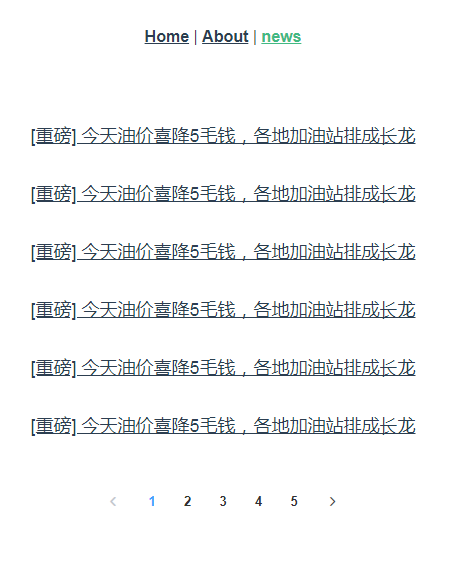

# 1.使用webpack创建一个项目并安装需要的加载器

## 步骤

1.先创建一个项目目录，并初始化

2.安装webpack并设置自动打包

3.设置默认预览页面和自动打开默认预览页面

4.安装css,less,sass,postcss等加载器

5.安装图片，字体文件加载器

6.安装babel加载器

# 2.使用脚手架创建一个项目，并在项目中引用单文件组件以及element-ui组件

## 步骤

效果图：

1.先创建一个脚手架vue项目

2.创建一个单文件组件

3.安装element-ui

4.将创建的单文件组件和element-ui组件放到vue项目中展示