###今日目标
1.初始化项目 
2.基于Vue技术栈进行项目开发
3.使用Vue的第三方组件进行项目开发
4.理解前后端分离开发模式

###1.电商业务概述
客户使用的业务服务：PC端，小程序，移动web，移动app
管理员使用的业务服务：PC后台管理端。
PC后台管理端的功能：管理用户账号（登录，退出，用户管理，权限管理），商品管理（商品分类，分类参数，商品信息，订单），数据统计
电商后台管理系统采用前后端分离的开发模式
前端项目是基于Vue的SPA（单页应用程序）项目

前端技术栈:Vue,Vue-Router,Element-UI,Axios,Echarts
后端技术栈：Node.js,Express,Jwt(模拟session),Mysql,Sequelize(操作数据库的框架)

###2.项目初始化
A.安装Vue脚手架
B.通过脚手架创建项目
C.配置路由
D.配置Element-UI:在插件中安装，搜索vue-cli-plugin-element
E.配置Axios：在依赖中安装,搜索axios(运行依赖)
F.初始化git仓库
G.将本地项目托管到github或者码云中

###3.码云相关操作
A.注册登录码云账号
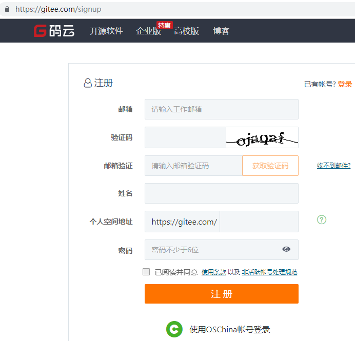

B.安装git
    在Windows上使用Git，可以从Git官网直接下载安装程序进行安装。
    测试命令：git --version

C.点击网站右上角“登录”，登录码云，并进行账号设置
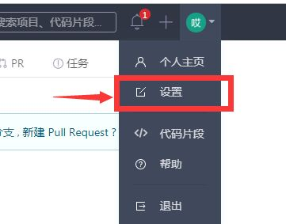

D.在本地创建公钥：在终端运行：ssh-keygen -t rsa -C "xxx@xxx.com"
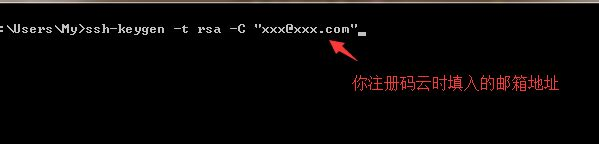
E.找到公钥地址：
Your identification has been saved in /c/Users/My/.ssh/id_rsa.
Your public key has been saved in /c/Users/My/.ssh/id_rsa.pub.
当我们创建公钥完毕之后，请注意打印出来的信息“Your public key has been saved in”
/c/Users/My/.ssh/id_rsa.pub : c盘下面的Users下面的My下面的.ssh下面的id_rsa.pub就是我们创建好的公钥了


E.打开id_rsa.pub文件，复制文件中的所有代码，点击码云中的SSH公钥，将生成的公钥复制到公钥中
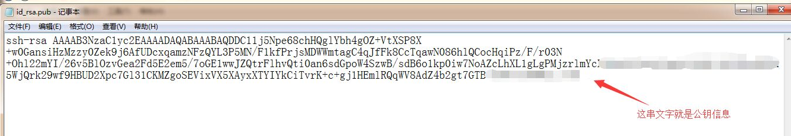

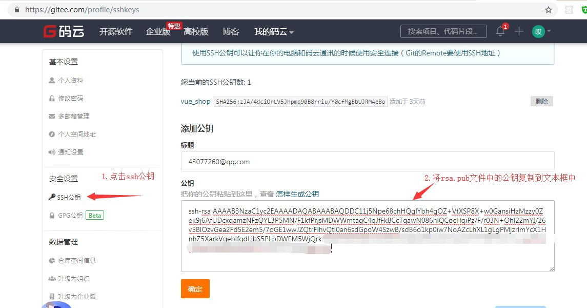
G.测试公钥：打开终端，输入命令
ssh -T git@gitee.com
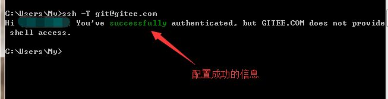

H.将本地代码托管到码云中
点击码云右上角的+号->新建仓库
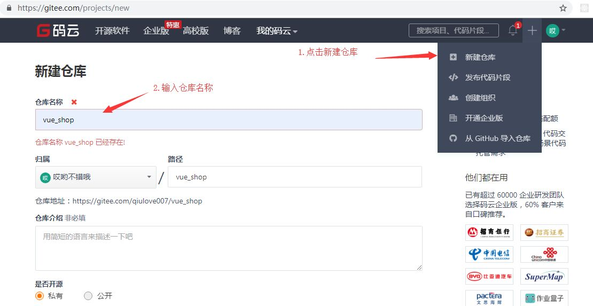


I.进行git配置：
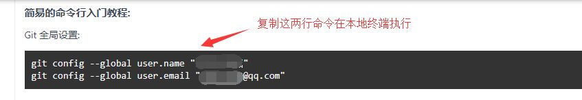
打开项目所在位置的终端，进行git仓库关联
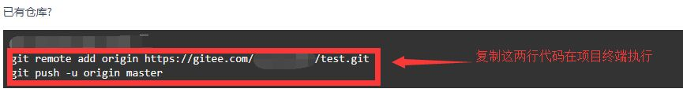


###4.配置后台项目
A.安装phpStudy并导入mysql数据库数据
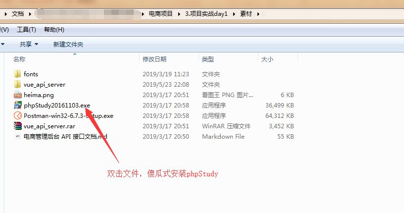

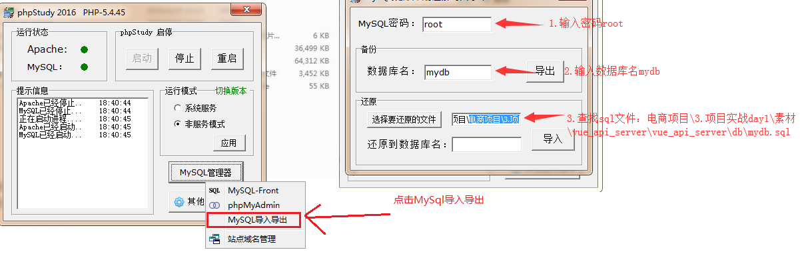
B.安装nodeJS，配置后台项目,从终端打开后台项目vue_api_server
然后在终端中输入命令安装项目依赖包：npm install

C.使用postman测试api接口
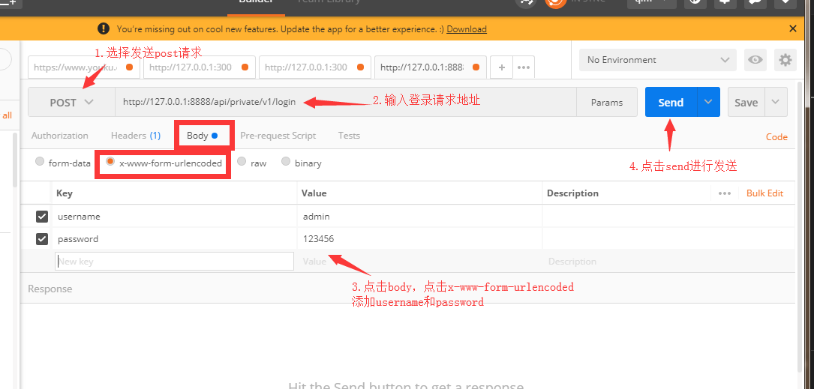

###5.实现登录功能
A.登录状态保持
如果服务器和客户端同源，建议可以使用cookie或者session来保持登录状态
如果客户端和服务器跨域了，建议使用token进行维持登录状态。

B.登录逻辑：
在登录页面输入账号和密码进行登录，将数据发送给服务器
服务器返回登录的结果，登录成功则返回数据中带有token
客户端得到token并进行保存，后续的请求都需要将此token发送给服务器，服务器会验证token以保证用户身份。

C.添加新分支login，在login分支中开发当前项目vue_shop：
打开vue_shop终端，使用git status确定当前项目状态。
确定当前工作目录是干净的之后，创建一个分支进行开发，开发完毕之后将其合并到master
git checkout -b login
然后查看新创建的分支：git branch
确定我们正在使用login分支进行开发
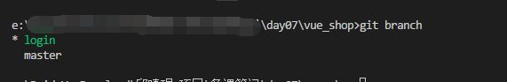

然后执行vue ui命令打开ui界面，然后运行serve，运行app查看当前项目效果
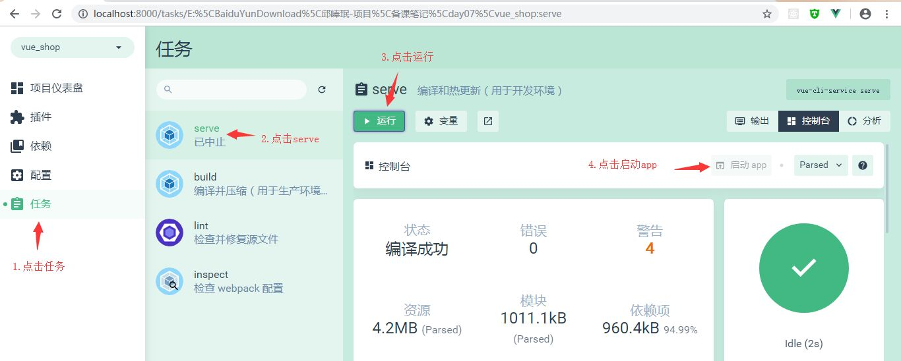

发现现在是一个默认页面，我们需要进行更改，打开项目的src目录，点击main.js文件（入口文件）
```
import Vue from 'vue'
import App from './App.vue'
import router from './router'
import './plugins/element.js'

Vue.config.productionTip = false


new Vue({
  router,
  render: h => h(App)
}).$mount('#app')

```
再打开App.vue(根组件)，将根组件的内容进行操作梳理(template中留下根节点，script中留下默认导出，去掉组件，style中去掉所有样式)
```
<template>
  <div id="app">
    <router-view></router-view>
  </div>
</template>

<script>
export default {
  name: 'app'
}
</script>

<style>
</style>
```
再打开router.js(路由)，将routes数组中的路由规则清除，然后将views删除，将components中的helloworld.vue删除
```
import Vue from 'vue'
import Router from 'vue-router'

Vue.use(Router)

export default new Router({
  routes: [
    
  ]
})
```
在components文件夹中新建Login.vue组件,添加template，script，style标签,style标签中的scoped可以防止组件之间的样式冲突，没有scoped则样式是全局的
```
<template>
    <div class="login_container">
        
    </div>
</template>

<script>
export default {
  
}
</script>

<style lang="less" scoped>
.login_container {
  background-color: #2b5b6b;
  height: 100%;
}

</style>
```
在router.js中导入组件并设置规则
在App.vue中添加路由占位符
```
const router = new Router({
  routes: [
    { path: '/', redirect: '/login' },
    { path: '/login', component: Login }
  ]
})
```

当我们给Login.vue中的内容添加样式的时候，会报错“缺少less-loader”，需要配置less加载器（开发依赖），安装less(开发依赖)
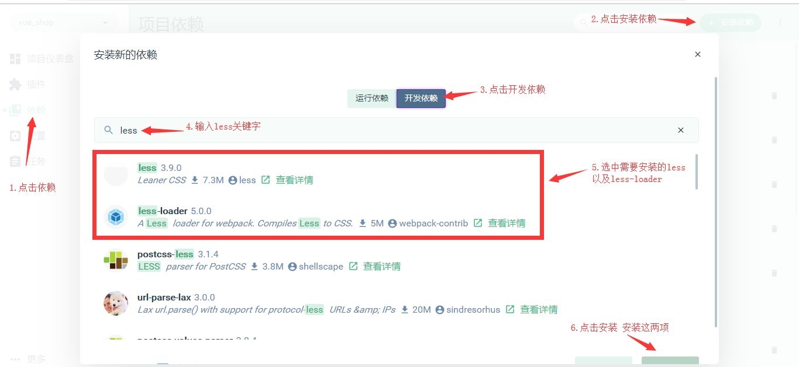
然后需要添加公共样式，在assets文件夹下面添加css文件夹，创建global.css文件,添加全局样式
```
/* 全局样式表 */
html,body,#app{
    width: 100%;
    height: 100%;
    margin: 0;
    padding: 0; 
}
```
在main.js中导入global.css，使得全局样式生效 import "./assets/css/global.css"
然后Login.vue中的根元素也需要设置撑满全屏（height:100%）
最终Login.vue文件中的代码如下
```
<template>
    <div class="login_container">
        <!-- 登录盒子  -->
        <div class="login_box">
            <!-- 头像 -->
            <div class="avatar_box">
                
            </div>
            <!-- 登录表单 -->
            <el-form :model="loginForm" ref="LoginFormRef" :rules="loginFormRules" label-width="0px" class="login_form">
                <!-- 用户名 -->
                <el-form-item prop="username">
                    <el-input v-model="loginForm.username" prefix-icon="iconfont icon-user" ></el-input>
                </el-form-item> 
                <!-- 密码 -->
                <el-form-item prop="password">
                    <el-input type="password" v-model="loginForm.password" prefix-icon="iconfont icon-3702mima"></el-input>
                </el-form-item> 
                <!-- 按钮 -->
                <el-form-item class="btns">
                    <el-button type="primary" @click="login">登录</el-button>
                    <el-button type="info" @click="resetLoginForm">重置</el-button>
                </el-form-item> 
            </el-form>
        </div>
    </div>
</template>

<script>
export default {
  data() {
    return {
      //数据绑定
      loginForm: {
        username: 'admin',
        password: '123456'
      },
      //表单验证规则
      loginFormRules: {
        username: [
          { required: true, message: '请输入登录名', trigger: 'blur' },
          {
            min: 3,
            max: 10,
            message: '登录名长度在 3 到 10 个字符',
            trigger: 'blur'
          }
        ],
        password: [
          { required: true, message: '请输入密码', trigger: 'blur' },
          {
            min: 6,
            max: 15,
            message: '密码长度在 6 到 15 个字符',
            trigger: 'blur'
          }
        ]
      }
    }
  },
  //添加行为，
  methods: {
    //添加表单重置方法
    resetLoginForm() {
      //this=>当前组件对象，其中的属性$refs包含了设置的表单ref
      //   console.log(this)
      this.$refs.LoginFormRef.resetFields()
    },
    login() {
      //点击登录的时候先调用validate方法验证表单内容是否有误
      this.$refs.LoginFormRef.validate(async valid => {
        console.log(this.loginFormRules)
        //如果valid参数为true则验证通过
        if (!valid) {
          return
        }

        //发送请求进行登录
        const { data: res } = await this.$http.post('login', this.loginForm)
        //   console.log(res);
        if (res.meta.status !== 200) {
          return this.$message.error('登录失败:' + res.meta.msg) //console.log("登录失败:"+res.meta.msg)
        }

        this.$message.success('登录成功')
        console.log(res)
        //保存token
        window.sessionStorage.setItem('token', res.data.token)
        // 导航至/home
        this.$router.push('/home')
      })
    }
  }
}
</script>

<style lang="less" scoped>
.login_container {
  background-color: #2b5b6b;
  height: 100%;
}
.login_box {
  width: 450px;
  height: 300px;
  background: #fff;
  border-radius: 3px;
  position: absolute;
  left: 50%;
  top: 50%;
  transform: translate(-50%, -50%);
  .avatar_box {
    height: 130px;
    width: 130px;
    border: 1px solid #eee;
    border-radius: 50%;
    padding: 10px;
    box-shadow: 0 0 10px #ddd;
    position: absolute;
    left: 50%;
    transform: translate(-50%, -50%);
    background-color: #fff;
    img {
      width: 100%;
      height: 100%;
      border-radius: 50%;
      background-color: #eee;
    }
  }
}
.login_form {
  position: absolute;
  bottom: 0;
  width: 100%;
  padding: 0 20px;
  box-sizing: border-box;
}
.btns {
  display: flex;
  justify-content: flex-end;
}
</style>

```

其中我们有用到一下内容，需要进行进一步处理：

A.添加element-ui的表单组件
在plugins文件夹中打开element.js文件，进行elementui的按需导入
import Vue from 'vue'
import { Button } from 'element-ui'
import { Form, FormItem } from 'element-ui'
import { Input } from 'element-ui'

Vue.use(Button)
Vue.use(Form)
Vue.use(FormItem)
Vue.use(Input)

B.添加第三方字体
复制素材中的fonts文件夹到assets中,在入口文件main.js中导入import './assets/fonts/iconfont.css'
然后直接在 <el-input prefix-icon="iconfont icon-3702mima"></el-input>
接着添加登录盒子

C.添加表单验证的步骤
1).给<el-form>添加属性:rules="rules"，rules是一堆验证规则，定义在script、中
2).在script中添加rules：export default{ data(){return{......, rules: {
          name: [
            { required: true, message: '请输入活动名称', trigger: 'blur' },
            { min: 3, max: 5, message: '长度在 3 到 5 个字符', trigger: 'blur' }
          ],
          region: [
            { required: true, message: '请选择活动区域', trigger: 'change' }
          ]
}......
3).通过<el-form-item>的prop属性设置验证规则<el-form-item label="活动名称" prop="name">

4.导入axios以发送ajax请求
打开main.js，import axios from 'axios';
设置请求的根路径：axios.defaults.baseURL = 'http://127.0.0.1:8888/api/private/v1/';
挂载axios：Vue.prototype.$http = axios;

5.配置弹窗提示：
在plugins文件夹中打开element.js文件，进行elementui的按需导入
import {Message} from 'element-ui'
进行全局挂载：Vue.prototype.$message = Message;
在login.vue组件中编写弹窗代码：this.$message.error('登录失败')


###6.登录成功之后的操作
A.登录成功之后，需要将后台返回的token保存到sessionStorage中
操作完毕之后，需要跳转到/home
```
login() {
      //点击登录的时候先调用validate方法验证表单内容是否有误
      this.$refs.LoginFormRef.validate(async valid => {
        console.log(this.loginFormRules)
        //如果valid参数为true则验证通过
        if (!valid) {
          return
        }

        //发送请求进行登录
        const { data: res } = await this.$http.post('login', this.loginForm)
        //   console.log(res);
        if (res.meta.status !== 200) {
          return this.$message.error('登录失败:' + res.meta.msg) //console.log("登录失败:"+res.meta.msg)
        }

        this.$message.success('登录成功')
        console.log(res)
        //保存token
        window.sessionStorage.setItem('token', res.data.token)
        // 导航至/home
        this.$router.push('/home')
      })
    }
```
添加一个组件Home.vue，并为之添加规则
```
<template>
    <div>
        this is home
        <el-button type="info" @click="logout"> 退出 </el-button>
    </div>
</template>

<script>
export default {
  methods: {
    logout() {
      window.sessionStorage.clear()
      this.$router.push('/login')
    }
  }
}
</script>

<style lang='less' scoped>
</style>
```
添加路由规则
```
const router = new Router({
  routes: [
    { path: '/', redirect: '/login' },
    { path: '/login', component: Login },
    { path: '/home', component: Home }
  ]
})
```


添加路由守卫
如果用户没有登录，不能访问/home,如果用户通过url地址直接访问，则强制跳转到登录页面
打开router.js
```
import Vue from 'vue'
import Router from 'vue-router'
import Login from './components/Login.vue'
import Home from './components/Home.vue'

Vue.use(Router)

const router = new Router({
  routes: [
    { path:'/', redirect:'/login'},
    { path:'/login' , component:Login },
    { path:'/home' , component:Home}
  ]
})

//挂载路由导航守卫,to表示将要访问的路径，from表示从哪里来，next是下一个要做的操作
router.beforeEach((to,from,next)=>{ 
  if(to.path === '/login')
    return next();
  
  //获取token
  const tokenStr = window.sessionStorage.getItem('token');

  if(!tokenStr)
    return next('/login');

  next();

})

export default router 
```

实现退出功能
在Home组件中添加一个退出功能按钮,给退出按钮添加点击事件，添加事件处理代码如下：
```
export default {
    methods:{
        logout(){
            window.sessionStorage.clear();
            this.$router.push('/login');
        }
    }
}
```

###补充
A.处理ESLint警告
打开脚手架面板，查看警告信息
[图片]
默认情况下，ESLint和vscode格式化工具有冲突，需要添加配置文件解决冲突。
在项目根目录添加 .prettierrc 文件
```
{
    "semi":false,
    "singleQuote":true
}
```
打开.eslintrc.js文件，禁用对 space-before-function-paren 的检查:
```
  rules: {
    'no-console': process.env.NODE_ENV === 'production' ? 'error' : 'off',
    'no-debugger': process.env.NODE_ENV === 'production' ? 'error' : 'off',
    'space-before-function-paren' : 0
  },
```

B.合并按需导入的element-ui
```
import Vue from 'vue'
import { Button, Form, FormItem, Input, Message } from 'element-ui'

Vue.use(Button)
Vue.use(Form)
Vue.use(FormItem)
Vue.use(Input)
// 进行全局挂载：
Vue.prototype.$message = Message
```

C.将代码提交到码云
新建一个项目终端,输入命令‘git status’查看修改过的与新增的文件内容
将所有文件添加到暂存区：git add .
将所有代码提交到本地仓库：git commit -m "添加登录功能以及/home的基本结构"
查看分支： git branch  发现所有代码都被提交到了login分支
将login分支代码合并到master主分支，先切换到master：git checkout master
在master分支进行代码合并：git merge login
将本地的master推送到远端的码云：git push

推送本地的子分支到码云，先切换到子分支：git checkout 分支名
然后推送到码云：git push -u origin 远端分支名
