Vue实战项目：电商管理系统

#  1. 项目概述

***

## 1.1 开发模式

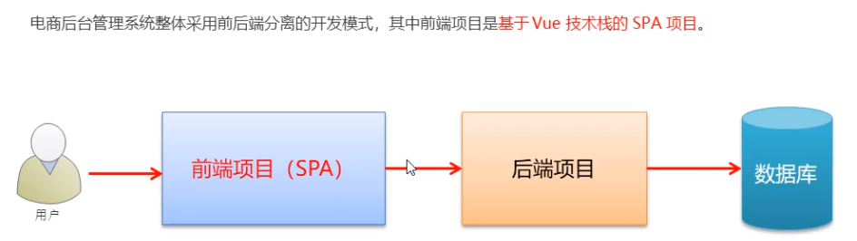

## 1.2 技术选型 

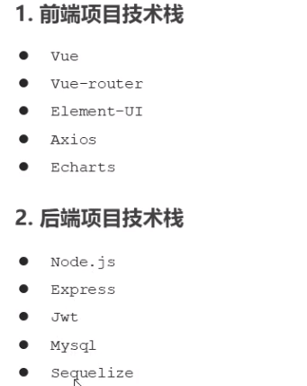

# 2. 项目初始化

***

## 2.1 前端项目初始化步骤


【注】：视频教程中使用的是vue-cli3，我的实际开发中使用的是vue-cli4

## 2.2 后台项目的环境安装配置

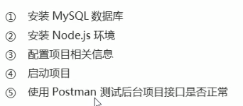

# 3. 登录/退出功能

***

## 3.1 概述

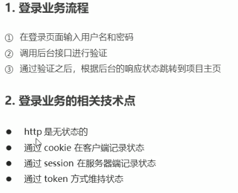

## 3.2 登录 - token原理分析

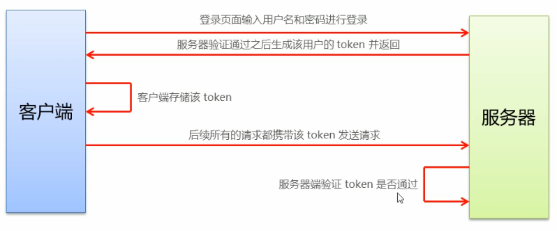


## 3.3 登录功能实现


代码实现：`Login.vue`

### **引用icon库：iconFont**

* 如何在vue项目中使用iconfont
*  https://www.jianshu.com/p/38262f18eee2 

注意：`<i class="iconfont icon-class" style="font-size:50px"></i>`调节图标大小是用font-size调节的

### 表单数据绑定

```js
//:model绑定数据
<el-form ref="loginFormRef" :model="loginForm" :rules="loginFormRules" label-width="0px" class="login_form">
        <!--用户名-->
        <el-form-item prop="username">
          <el-input v-model="loginForm.username" prefix-icon="iconfont iconuser"></el-input>
        </el-form-item>
        <!--密码-->
        <el-form-item prop="password">
          <el-input type="password" v-model="loginForm.password" prefix-icon="iconfont iconi-pwd"></el-input>
        </el-form-item>
      </el-form>
//...
data(){
    return {
      //登陆表单的数据绑定对象
      loginForm:{
        username:'admin',
        password:'123456',
      },
    }
  },
```

### 表单数据验证

绑定rules

```html
<el-form ref="loginFormRef" :model="loginForm" :rules="loginFormRules" label-width="0px" class="login_form">
```

data中

```js
data(){
    return {
      //这是表单的验证规则对象
      loginFormRules:{
        //验证用户名是否合法
        username:[
          { required:true, message:"请输入登录用户名", trigger:"blur"},
          { min:3, max:10, message:"长度在3到10个字符中间", trigger:"blur"}
        ],
      }
    }
  },
```

### 重置表单

```html
<el-button type="info" @click="resetLoginForm">重置</el-button>
```

```js
methods:{
    //重置登录表单
    resetLoginForm(){
      //console.log(this);
      this.$refs.loginFormRef.resetFields();
    },
}
```

### 登陆前表单数据预验证

```html
<el-button type="primary" @click="login">登录</el-button>
```

```js
methods:{
    //登录预验证 valid是验证结果 判断验证通过/失败
    login(){
      this.$refs.loginFormRef.validate(async valid =>{
        //console.log(valid);
        if(!valid) return;
        //发送请求
        const {data: res} = await this.$http.post('login',this.loginForm);//操作返回的是await，可以使用async和await简化操作
        if(res.meta.status!==200) return this.$message.error('登陆失败');
        this.$message.success('登陆成功')
        //1. 将登陆成功之后的token，保存到客户端的sessionStorage中
        //  1.1 项目中除了登录之外的其他API接口，必须在登录之后才能访问
        //  1.2 token只应当在当前网站打开期间生效，所以将token保存在sessionStorage中
        console.log(res);
        window.sessionStorage.setItem('token',res.data.token);
        //2. 通过编程式导航跳转到后台主页，路由地址是 /home
        this.$router.push('/home')
      });
    }
```

### 配置`axios`发起登录请求

注意：这里的发送请求利用后端的`api`，使用`axios`

在`main.js`中

```js
import axios from 'axios'
//配置请求根路径
axios.defaults.baseURL = 'http://timemeetyou.com:8889/api/private/v1/'
Vue.prototype.$http = axios;//可以直接使用this.$http来请求
```

### 配置Message全局弹框请求

在`element.js`中

```js
import Vue from 'vue'

//按需导入element-ui组件
import {
  Button,Message,
 } from 'element-ui'

Vue.use(Button)
//将弹框组件挂载到vue的原型上，使得每个组件都可以通过this.$message访问
Vue.prototype.$message = Message;
```

### 路由导航守卫

控制页面的访问权限，只有登陆了才可以继续进行之后的操作

`router.js`中

```js
import Vue from 'vue'
import Router from 'vue-router'
import Login from '../components/Login.vue'
import Home from '../components/Home.vue'

Vue.use(Router)

const router = new Router({
  routes:[
    //访问根路径时，重定向到login
    { path:'/',redirect:'/login'},
    { path:'/login',component:Login},
    { path:'/home',component:Home}
  ]
})

//挂载路由导航守卫
router.beforeEach((to,from,next)=>{
  //to 将要访问的路径
  //from 代表从哪个路径跳转而来
  //next 函数 表示放行
  //   next() 放行 next('/login')强制跳转
  if(to.path === '/login') return next();
  // 获取token
  const tokenStr = window.sessionStorage.getItem('token');
  if(!tokenStr) return next('/login');
  next();
})

export default router
```

## 3.4  退出

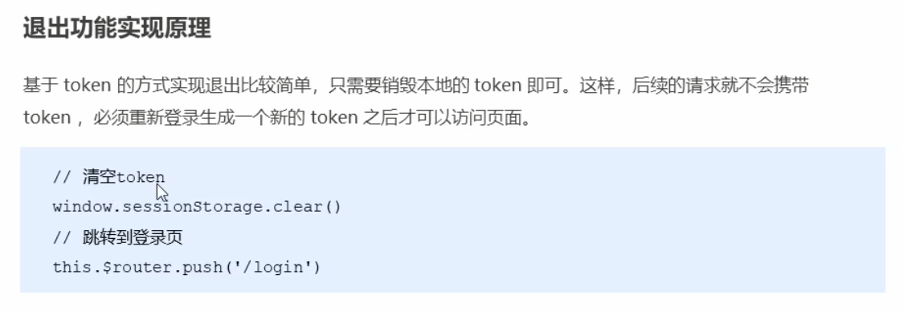

### 实现退出功能

```html
<el-button type="info" @click="logout">退出</el-button>
```

```js
export default {
  methods: {
    logout() {
      //清空token
      window.sessionStorage.clear();
      //跳转到登陆页面
      this.$router.push('/login');
    }
  }
};
```

### 使用git提交代码到码云中

```
git add .
git status
git commit -m "完成了登录功能"
git push //提交msater
git push -u origin login //提交到新分支login
```

# 4. 主页布局

***

## 4.1 整体布局

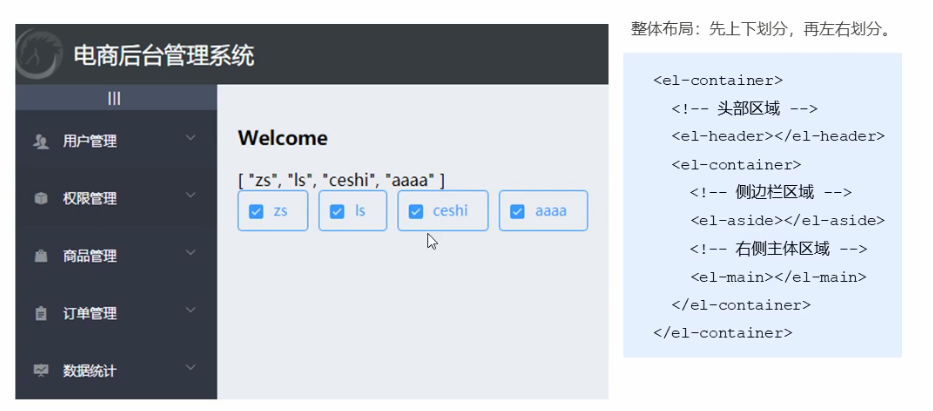

实现 `Home.vue`

## 4.2 左侧菜单布局

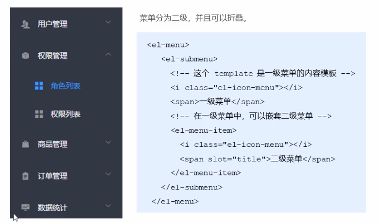

## 4.3 通过接口获取菜单数据

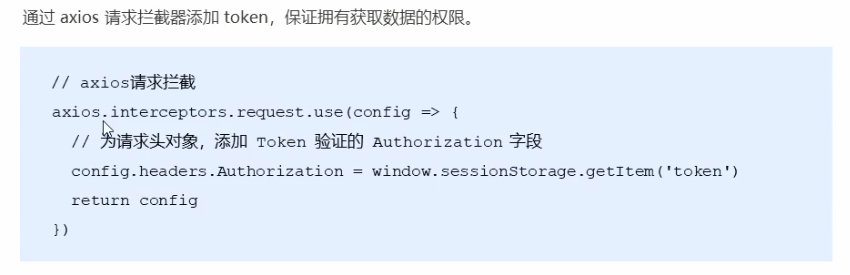

【注】：需要授权的 API ，必须在请求头中使用 `Authorization` 字段提供 `token` 令牌，后端验证token是否正确和过期。

在`main.js`中

```js
import axios from 'axios'
//配置请求根路径
axios.defaults.baseURL = 'http://timemeetyou.com:8889/api/private/v1/'
axios.interceptors.request.use(config => {
  console.log(config);
  //为请求头对象，添加token认证的Authorization字段
  config.headers.Authorization = window.sessionStorage.getItem('token');
  //最后必须return config
  return config;
})
Vue.prototype.$http = axios;
```

`Home.vue`中

**设置二级菜单：**

* 首先通过接口获取左侧菜单数据
* 然后使用双层for循环渲染菜单
* 侧边栏路由链接改造：`el-menu router>`设置router，根据二级菜单的index值直接设置路由链接。

**样式设置：**

* 添加分类的图标，利用数组`iconsObj`每个菜单都有一个id，对应设置其icon

* 设置每次只能打开一个菜单项`unique-opened`

* 侧边栏的折叠与展开 `<el-menu :collapse="isCollapse" router>`: 绑定属性isCollapse,点击切换按钮来改变其值实现折叠与展开


```html
<template>
  <el-container class="home-container">
    <!--头部区域-->
    <el-header>
      <div>
        
        <span>电商后台管理系统</span>
      </div>
      <el-button type="info" @click="logout">退出</el-button>
    </el-header>
    <!--页面主题区域-->
    <el-container>
      <!--侧边栏-->
      <el-aside :width="isCollapse ? '64px':'200px'">
        <div class="toggle-button" @click="toggleCollapse">|||</div>
        <!--侧边栏菜单区域-->
        <el-menu unique-opened background-color="#333744" 
        text-color="#fff" active-text-color="#409BFF"
        :collapse-transition="false" 
        :collapse="isCollapse" router>
          <!--一级菜单-->
          <el-submenu :index="item.id+''" v-for="item in menuList" :key="item.id">
            <!--一级菜单的模板区域-->
            <template slot="title">
              <!--图标-->
              <i :class="iconsObj[item.id]"></i>
              <!--文本-->
              <span>{{item.authName}}</span>
            </template>

            <!--二级菜单-->
            <el-menu-item :index="'/'+subItem.path" v-for="subItem in item.children" :key="subItem.id">
              <i class="el-icon-menu"></i>
              <span>{{subItem.authName}}</span>
            </el-menu-item>
          </el-submenu>
        </el-menu>
      </el-aside>
      <!--右侧内容主体-->
      <el-main>
        <!--路由占位符-->
        <router-view></router-view>
      </el-main>
    </el-container>
  </el-container>
</template>
```

```js

<script>
export default {
  data(){
    return {
      //左侧菜单数据
      menuList:[],
      iconsObj:{
        '125':'iconfont iconuser',
        '103':'iconfont icontijikongjian',
        '101':'iconfont iconshangpin',
        '102':'iconfont icondanju',
        '145':'iconfont iconbaobiao'
      },
      //是否折叠
      isCollapse:false,
    }
  },
  created(){
    this.getMenuList();
  },
  methods: {
    logout() {
      //清空token
      window.sessionStorage.clear();
      //跳转到登陆页面
      this.$router.push("/login");
    },
    //获取所有的菜单
    async getMenuList(){
      const {data:res} = await this.$http.get('menus');
      if(res.meta.status != 200) return this.$message.error(res.meta.msg);
      this.menuList = res.data;
      console.log('请求菜单返回的结果：',res);
    },
    //点击按钮切换菜单的折叠与展开
    toggleCollapse(){
      this.isCollapse = !this.isCollapse;
    }
  }
};
</script>
```

### 通过路由的形式展现用户列表

定义组件 `User.vue`

再修改`router.js`（嵌套进home组件，home包含一个子路由用户列表）

```js
import Users from '../components/user/Users.vue'

const router = new Router({
  routes:[
    //访问根路径时，重定向到login
    { path:'/',redirect:'/login'},
    { path:'/login',component:Login},
    { path:'/home',
      component:Home,
      redirect:'/welcome',
      children:[
        { path:'/welcome',component:Welcome},
         //获取用户列表的组件
        { path:'/users',component:Users},
    ]}
  ]
})
```

### 在`sessionStorage`中保存左侧菜单的激活状态(高亮状态)

Menu中设置属性`deafult-active`,将这个值绑定到`<el-menu  :default-active="activePath">` `activePath`中，每次点击链把对应的地址保存到`sessionStorage`当中，当刷新页面的时候再取出动态赋值给菜单。

在`Home.vue`中

二级菜单绑定单击事件

```html
<!--二级菜单-->
        <el-menu-item :index="'/'+subItem.path" v-for="subItem in item.children" :key="subItem.id" @click="saveNavState('/'+subItem.path)">
          <i class="el-icon-menu"></i>
          <span>{{subItem.authName}}</span>
        </el-menu-item>
```

动态绑定到`sessionStoarge`中,整个home组件创建时执行created(),就将`activePath`保存

```js
<script>
export default {
  data(){
    return {
      //被激活的链接地址
      activePath:'',
    }
  },
  created(){
    this.getMenuList();
    this.activePath = window.sessionStorage.getItem('activePath');
  },
  methods: 
    //保存链接的激活状态
    saveNavState(activePath){
      window.sessionStorage.setItem('activePath',activePath);
      this.activePath = activePath;
    }
  }
};
</script>
```

# 5. 用户管理

## 5.1 用户列表

### 用户列表组件布局

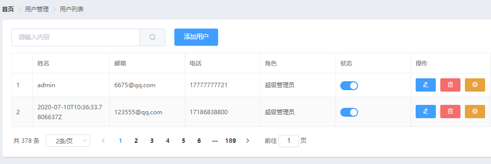

使用el-row和el-col

### 获取用户列表数据

`User.vue`

data中

* `queryInfo`表示调用API的时候的传参
* `userList`和total接受数据

created中

* 初始化组件时获取用户列表（在methods中定义方法，获取数据返回给userList和total）

```html
<script>
export default {
  data(){
    return {
      //获取用户列表的参数对象
      queryInfo:{
        query:'',
        pagenum:1,
        pagesize:2
      },
      userList:[],
      total:0,
    }
  },
  created(){
    this.getUserList()
  },
  methods:{
    async getUserList(){
      const {data:res} = await this.$http.get('users',{params:this.queryInfo})
      if(res.meta.status!==200) {
        return this.$message.error('获取用户列表失败')
      }
      this.userList = res.data.users;
      this.total = res.data.total;
      //console.log(res);  
    }
  }
};
</script>
```

### 使用el-table组件渲染用户列表

为el-table绑定data,为el-table-column指定`label`和`prop`

### 为表格添加索引列

在头部加一列 `<el-table-column type="index"></el-table-column>`

### 自定义状态列的显示效果

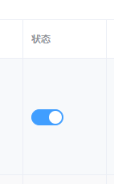

```html
<!--用户列表-->
      <el-table :data="userList" border stripe>
        <el-table-column type="index"></el-table-column>
        <el-table-column label="姓名" prop="username"></el-table-column>
        <el-table-column label="邮箱" prop="email"></el-table-column>
        <el-table-column label="电话" prop="mobile"></el-table-column>
        <el-table-column label="角色" prop="role_name"></el-table-column>
        <el-table-column label="状态">
          <template slot-scope="scope">
            <!--{{scope.row}}-->
            <el-switch v-model="scope.row.mg_state">
            </el-switch>
          </template>
        </el-table-column>
        <el-table-column label="操作"></el-table-column>
      </el-table>
```

`scoper.row`获得这一列的结果，绑定其上的数据，改变状态的展示形式

### 通过作用域插槽渲染操作列

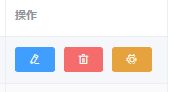

```html
<el-table-column label="操作" width="180px">
      <template slot-scope="scope">
        <el-button type="primary" icon="el-icon-edit" @click="showEditDialog(scope.row.id)"></el-button>                     <el-button type="danger" icon="el-icon-delete"  @click="removeUserById(scope.row.id)" ></el-button>
            <el-tooltip effect="dark" content="分配角色" placement="top-start" enterable="false">
              <el-button type="warning" icon="el-icon-setting" @click="setRole(scope.row)"></el-button>
            </el-tooltip>
          </template>
        </el-table-column>
```

### 分页效果

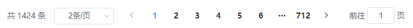

```html
<!--分页区域-->
      <el-pagination @size-change="handleSizeChange" @current-change="handleCurrentChange"
      :current-page="queryInfo.pagenum"
      :page-sizes="[1, 2, 5, 10]"
      :page-size="queryInfo.pagesize"
      layout="total, sizes, prev, pager, next, jumper"
      :total="total">
    </el-pagination>
```

### 修改用户状态

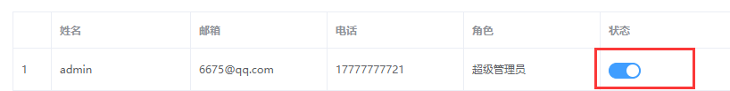

```html
 <!--用户列表-->
      <el-table :data="userList" border stripe>
        <el-table-column label="状态">
          <template slot-scope="scope">
            <!--{{scope.row}}-->
            <el-switch v-model="scope.row.mg_state" @change="userStateChange(scope.row)"></el-switch>
          </template>
        </el-table-column>
      </el-table>
```

```js
//监听switch开关状态的改变
    async userStateChange(userinfo){
      console.log('当前改变状态的用户：',userinfo);
      const {data: res} = await this.$http.put(`users/${userinfo.id}/state/${userinfo.mg_state}`);
      if(res.meta.status!==200){
        userinfo.mg_state = !userInfo.mg_state;
        return this.$message.error('更新用户状态失败！');
      }
      this.$message.success('更新用户状态成功！')
    }
```

## 5.2 搜索用户功能

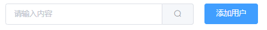

```html
<el-input placeholder="请输入内容" v-model="queryInfo.query" clearable @clear="getUserList">
            <el-button slot="append" icon="el-icon-search" @click="getUserList"></el-button>
          </el-input>
```

使用数据绑定 `v-model="queryInfo.query"`，查询时直接使用`queryInfo`查询用户列表

## 5.3 添加用户功能

在data中定义一个addDialogVisiable

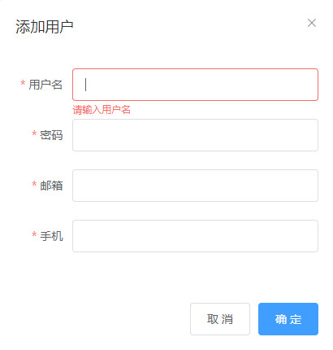

```html
<el-button type="primary" @click="addDialogVisiable=true">添加用户</el-button>
```

```html
<!--添加用户的对话框-->
      <el-dialog title="添加用户" :visible.sync="addDialogVisiable" width="50%">
        <el-form 
          :model="adddForm" :rules="addFormRules" ref="addFormRef"
          label-width="70px">
          <el-form-item label="用户名" prop="username">
            <el-input v-model="adddForm.username"></el-input>
          </el-form-item>
          <el-form-item label="密码" prop="password">
            <el-input v-model="adddForm.password"></el-input>
          </el-form-item>
          <el-form-item label="邮箱" prop="email">
            <el-input v-model="adddForm.email"></el-input>
          </el-form-item>
          <el-form-item label="手机" prop="mobile">
            <el-input v-model="adddForm.mobile"></el-input>
          </el-form-item>
        </el-form>
        <span slot="footer" class="dialog-footer">
          <el-button @click="addDialogVisiable = false">取 消</el-button>
          <el-button type="primary" @click="addDialogVisiable = false">确 定</el-button>
        </span>
      </el-dialog>
```

model数据绑定，rules规则，ref引用对象

### 邮箱和手机号校验规则

```js
data() {
    //验证邮箱的规则
    var checkEmail = (rule, value, cb) => {
      //验证邮箱的正则表达式
      const regEmail = /^([a-zA-Z0-9_-])+@([a-zA-z0-9_-])+(\.[a-zA-Z0-9_-])+/;
      if (regEmail.test(value)) {
        //合法的邮箱
        return cb();
      }
      cb(new Error("请输入合法的邮箱"));
    };

    //验证手机的规则
    var checkMobile = (rule, value, cb) => {
      //验证手机的正则表达式
      const regMobile = /^(0|86|17951)?(13[0-9]|15[0123456789]|17[678]|18[0-9]|14[57])[0-9]{8}$/
      if (regMobile.test(value)) {
        //合法的邮箱
        return cb();
      }
      cb(new Error("请输入合法的手机号"));
    };

    return {
      //添加用户的表单数据
      adddForm: {
        email: "",
        mobile: ""
      },
      //添加表单的验证规则对象
      addFormRules: {
        email: [
          { required: true, message: "请输入邮箱", trigger: "blur" },
          { validator:checkEmail,trigger:'blur'}
        ],
        mobile: [
          { required: true, message: "请输入手机", trigger: "blur" },
          { validator:checkMobile,trigger:'blur'}]
      }
    };
  },
```

在data中通过`var`定义变量的形式定义规则函数

然后在`FormRules`中通过`validator`指定自定义校验规则，`trigger`触发什么时候使用规则

### 添加表单的重置操作

给表单绑定关闭事件，关闭时重置表单

```html
<el-dialog title="添加用户" :visible.sync="addDialogVisiable" width="50%" @close="addDialogClosed">
```

```js
    //监听添加用户对话框的关闭事件
    addDialogClosed(){
      this.$refs.addFormRef.resetFields();
    },
```

### 添加用户

```js
    //点击按钮，添加新用户
    addUser(){
      this.$refs.addFormRef.validate(async valid =>{
        //console.log(valid);
        if(!valid) return 
        //可以发起添加用户的网络请求
        const {data:res} = await this.$http.post('users',this.addForm);
        if(res.meta.status!==201){
          this.$message.error('添加用户失败');
        }
        this.$message.success('添加用户成功');
        //隐藏添加用户的对话框
        this.addDialogVisiable = false;
        //重新刷新用户列表
        this.getUserList();
      })
    }
```

## 5.4 修改用户

对话框同添加

* 修改用户的界面上的信息：要根据用户id查询对应的用户信息
* 对于无法修改的字段使用`disabled`约束
* 修改表单的重置操作采用`ref的resetField`方法

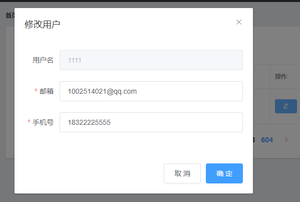

```vue
<el-table-column label="操作" width="180px">
          <template slot-scope="scope">
            <!--修改按钮-->
            <el-button type="primary" icon="el-icon-edit" size="mini" @click="showEditDialog(scope.row.id)"></el-button>
          </template>
        </el-table-column>
```

```vue
<!--修改用户的对话框-->
      <el-dialog title="修改用户" :visible.sync="editDialogVisiable" width="50%" @close="editDialogClosed">
        <el-form :model="editForm" :rules="editFormRules" ref="editFormRef" label-width="70px">
          <el-form-item label="用户名">
            <el-input v-model="editForm.username" disabled></el-input>
          </el-form-item>
          <el-form-item label="邮箱" prop="email">
            <el-input v-model="editForm.email"></el-input>
          </el-form-item>
          <el-form-item label="手机号" prop="mobile">
            <el-input v-model="editForm.mobile"></el-input>
          </el-form-item>
        </el-form>
        <span slot="footer" class="dialog-footer">
          <el-button @click="editDialogVisiable = false">取 消</el-button>
          <el-button type="primary" @click="editUserInfo">确 定</el-button>
        </span>
      </el-dialog>
```

```js
//修改用户信息并提交
    editUserInfo(){
      this.$refs.editFormRef.validate( async valid =>{
          //console.log("修改信息的校验",valid);
          if(!valid) return;
          //发起修改用户的数据请求
          const {data:res} = await this.$http.put('users/'+ this.editForm.id,{
            email:this.editForm.email,
            mobile:this.editForm.mobile
          })

          if(res.meta.status!==200){
          this.$message.error('更新用户信息失败！');
          }
          //注意：修改一般都会有这三个操作
          //关闭对话框
          this.editDialogVisiable = false;
          //刷新数据列表
          this.getUserList();//直接调用method
          //提示修改成功
          this.$message.success('更新用户信息成功！');
        })
    }
```

## 5.5 删除用户

```vue
<!--删除按钮-->
<el-button type="danger" icon="el-icon-delete" size="mini" @click="removeUserById(scope.row.id)"></el-button>
```

* 提醒用户是否要删除（进行二次确认)

```js
//根据id删除对应的用户信息
    async removeUserById(id){
      //console.log("删除的用户id为：",id);
      //弹框询问用户是否删除数据
      const confirmResult = await this.$confirm('此操作将永久删除该用户, 是否继续?', '提示', {
          confirmButtonText: '确定',
          cancelButtonText: '取消',
          type: 'warning'
       }
      ).catch(err=>err)

      //如果用户确认删除，则返回值为字符串 confirm
      //如果用户取消了删除，则返回值为字符串 cancel
      //console.log(confirmResult);
      if(confirmResult !== 'confirm'){
        return this.$message.info('已取消删除')
      }
      //console.log('确认了删除');
      const {data:res} =  await this.$http.delete('users/'+id);
      if(res.meta.status!==200){
        this.$message.error('删除用户失败！');
      }
      this.$message.success('删除用户成功！');
      this.getUserList();
    }
```

## 5.6 创建user子分支并推送代码到码云

在本地创建新分支user

`git branch`查看分支

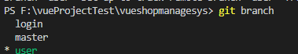

`git push -u origin user`远程仓库创建新分支，并推送当前分支(user）内容到远程

修改完代码后，将本地的user合并到master分支：

`git checkout master` 切换到master分支

`git merge user `本地user分支与master分支合并

`git push`直接将当前本地master分支推送到远程master分支

# 6. 权限管理

***

## 6.1 权限管理业务分析

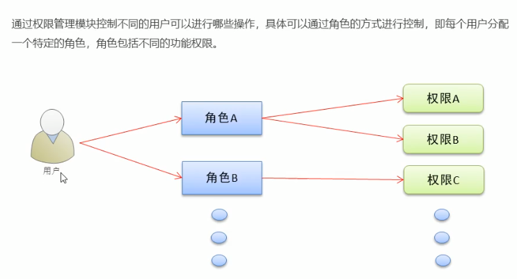

用户绑定不同的角色，角色拥有不同的权限。

## 6.2 创建right子分支并推送

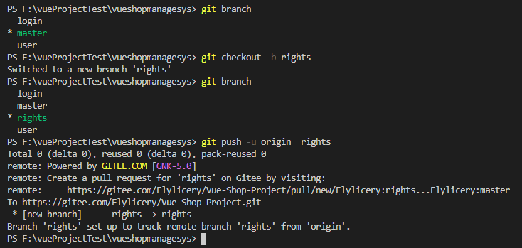

## 6.3 权限列表

### 绘制面包屑导航与权限视图

```vue
    <!--面包屑导航区域-->
    <el-breadcrumb separator-class="el-icon-arrow-right">
      <el-breadcrumb-item :to="{ path: '/' }">首页</el-breadcrumb-item>
      <el-breadcrumb-item>权限管理</el-breadcrumb-item>
      <el-breadcrumb-item>权限列表</el-breadcrumb-item>
    </el-breadcrumb>
```


### 获取权限列表的数据

```js
<script>
export default {
  data(){
    return {
      //权限列表
      rightsList:[],
    }
  },
  created(){
    //获取所有的权限
    this.getRightsList();
  },
  methods:{
    //获取权限列表
    async getRightsList(){
      const {data:res} = await this.$http.get('rights/list');
      if(res.meta.status!==200){
        return this.$message.error('获取权限列表失败！')
      }
      this.rightsList = res.data;
      console.log(this.rightsList);
    }
  }
}
</script>
```

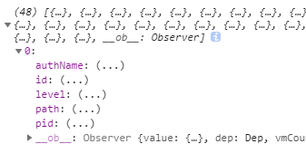

### 渲染权限列表UI结构

```vue
<!--卡片视图-->
    <el-card>
      <el-table :data="rightsList" border stripe >
        <el-table-column type="index"></el-table-column>
        <el-table-column label="权限名称" prop="authName"></el-table-column>
        <el-table-column label="路径" prop="path"></el-table-column>
        <el-table-column label="权限等级" prop="pid">
          <template slot-scope="scope">
            <el-tag v-if="scope.row.level == '0'">一级</el-tag>
            <el-tag type="success" v-else-if="scope.row.level == '1'">二级</el-tag>
            <el-tag type="warning" v-else>三级</el-tag>
          </template>
        </el-table-column>
      </el-table>
    </el-card>
```

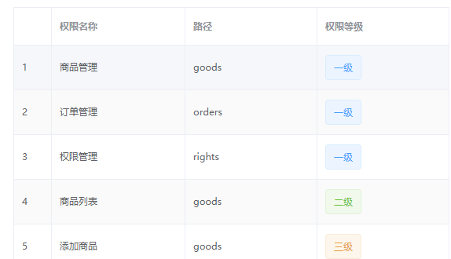

## 6.4 角色列表

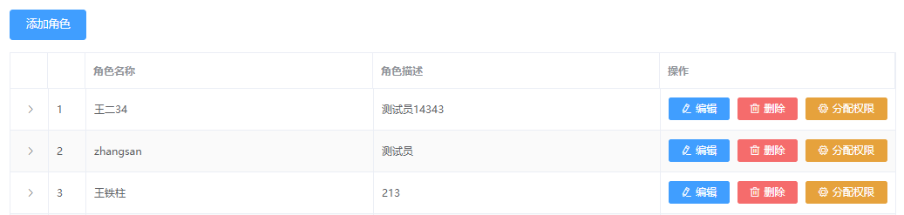

### 角色列表 

```js
<script>
export default {
  data(){
    return {
      //所有角色的列表数据
      roleList:[],
    }
  },
  created(){
    this.getRolesList();
  },
  methods:{
    //获取所有角色列表
    async getRolesList(){
      const {data:res} = await this.$http.get('roles');
      if(res.meta.status!==200){
        return this.$message.error('获取角色列表失败！');
      }
      this.roleList = res.data;
      console.log(res.data);
    }
  }
}
</script>
```

```vue
<!--卡片视图-->
    <el-card>
      <!--添加角色按钮区域-->
      <el-row>
        <el-col>
          <el-button type="primary">添加角色</el-button>
        </el-col>
      </el-row>
      <!--角色列表区域-->
      <el-table :data="roleList" border stripe>
        <!--展开列-->
        <el-table-column type="expand"></el-table-column>
        <!--索引列-->
        <el-table-column type="index"></el-table-column>
        <el-table-column label="角色描述" prop="roleDesc"></el-table-column>
        <el-table-column label="操作" width="300px">
          <template slot-scope="scope">
            <el-button type="primary" size="mini" icon="el-icon-edit">编辑</el-button>
            <el-button type="danger" size="mini" icon="el-icon-delete">删除</el-button>
            <el-button type="warning" size="mini" icon="el-icon-setting">分配权限</el-button>
          </template>
        </el-table-column>
      </el-table>
    </el-card>
```

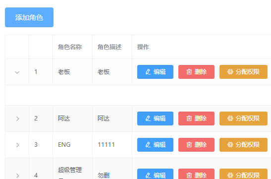

### 角色下权限渲染

scope.row拿到角色信息，三层for循环来渲染。


获取角色列表返回的结果如下：

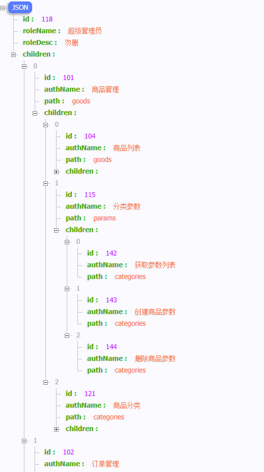

#### 通过第一层for循环渲染一级权限

```vue
<!--展开列-->
        <el-table-column type="expand">
          <template slot-scope="scope">
            <el-row v-for="(item1,i1) in scope.row.children" :key="item1.id">
              <!--渲染一级权限-->
              <el-col :span="5">
                <el-tag>{{item1.authName}}</el-tag>
              </el-col>
              <!--渲染二级和三级权限-->
              <el-col :span="19"></el-col>
            </el-row>
            <pre>
              {{scope.row}}
            </pre>
          </template>
        </el-table-column>
```

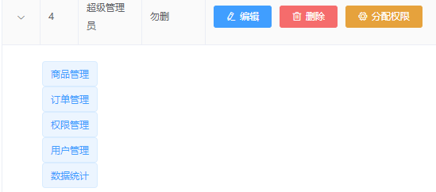

#### 美化一级权限的UI

每个权限下面+下边框，第一个权限+上边框

```vue
<!--展开列-->
        <el-table-column type="expand">
          <template slot-scope="scope">
			<!--看这里！！！-->
            <el-row :class="['bdbottom',i1 === 0?'bdtop':'']" v-for="(item1,i1) in scope.row.children" :key="item1.id">
              <!--渲染一级权限-->
              <el-col :span="5">
                <el-tag>{{item1.authName}}</el-tag>
                <i class="el-icon-caret-right"></i>
              </el-col>
              <!--渲染二级和三级权限-->
              <el-col :span="19"></el-col>
            </el-row>
            <pre>
              {{scope.row}}
            </pre>
          </template>
        </el-table-column>
```

给`el-row`每一行绑定类`bdbottom`,使得它拥有下边框，对于第一个row（即它的index为0的时候，给他绑定类`bdtop`（使用三元表达式判断)

```less
<style lang="less" scoped>
.el-tag{
 margin: 7px;
}
.bdtop{
  border-top: 1px solid #eee;
}
.bdbottom{
  border-bottom: 1px solid #eee;
}
</style>
```

加入css美化后结果

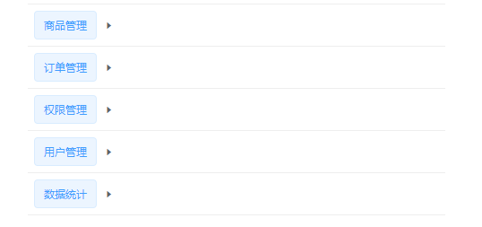

#### 通过第二/三层for循环渲染二/三级权限

```vue
<!--展开列-->
        <el-table-column type="expand">
          <template slot-scope="scope">
            <el-row
              :class="['bdbottom',i1 === 0?'bdtop':'','vcenter']"
              v-for="(item1,i1) in scope.row.children"
              :key="item1.id"
            >
              <!--渲染一级权限-->
              <el-col :span="5">
                <el-tag closable @close="removeRightById(scope.row,item1.id)">{{item1.authName}}</el-tag>
                <i class="el-icon-caret-right"></i>
              </el-col>
              <!--渲染二级和三级权限-->
              <el-col :span="19">
                <!--通过for循环渲染二级权限-->
                <el-row
                  :class="[i2 === 0?'':'bdtop','vcenter']"
                  v-for="(item2,i2) in item1.children"
                  :key="item2.id"
                >
                  <el-col :span="6">
                    <el-tag
                      type="success"
                      closable
                      @close="removeRightById(scope.row,item2.id)"
                    >{{item2.authName}}</el-tag>
                    <i class="el-icon-caret-right"></i>
                  </el-col>
                  <el-col :span="18">
                    <el-tag
                      type="warning"
                      v-for="(item3,i3) in item2.children"
                      :key="item3.id"
                      closable
                      @close="removeRightById(scope.row,item3.id)"
                    >{{item3.authName}}</el-tag>
                  </el-col>
                </el-row>
              </el-col>
            </el-row>
            <!-- <pre>
              {{scope.row}}
            </pre>-->
          </template>
        </el-table-column>
```

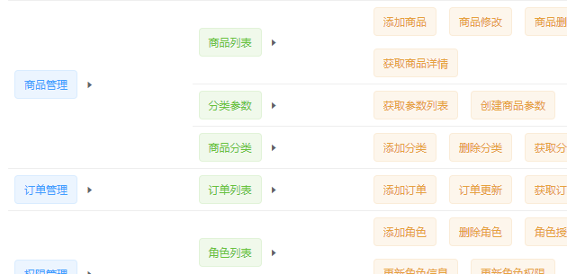

**美化页面**

对于缩小页面元素会换行的情况，指定全局样式表的`min-width`可以解决，当页面缩小，底部有滑动条

```css
html,body,#app{
  height: 100%;
  margin: 0;
  padding: 0;
  min-width: 1366px;
}
```

实现垂直方向上居中对齐，使用flex布局，添加样式vcenter

```css
.vcenter{
  display:flex;
  align-items:center
}
```

### 删除角色下指定权限

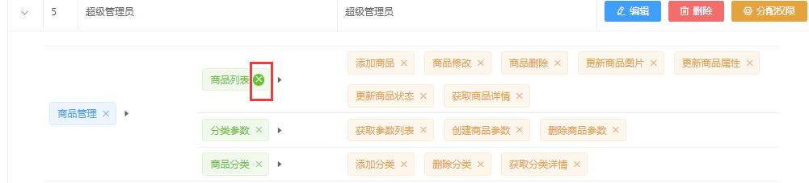

在每个`<el-tag>`后增加一个属性`closable`,并绑定事件`@close="removeRightById(scope.row,item2.id)"`,将当前行的信息+要删除的权限的id传给API

template详情见上小节，

script中methods里方法如下：

```js
//根据id删除对应的权限
    async removeRightById(role, rightId) {
      //弹框提示用户是否要删除
      const confirmResult = await this.$confirm(
        "此操作将删除用户权限",
        "提示",
        {
          confirmButtonText: "确定",
          cancelButtonText: "取消",
          type: "warning"
        }
      ).catch(err => err);
      if (confirmResult !== "confirm") {
        return this.$message.info("取消了删除！");
      }
      //console.log("确认了删除！");
      const { data: res } = await this.$http.delete(
        `roles/${role.id}/rights/${rightId}`
      );

      if (res.meta.status !== 200) {
        return this.$message.error("删除权限失败");
      }
      //this.getRolesList();//这样会页面全部渲染
      role.children = res.data;//服务器返回的最新权限直接赋给role数据，不用刷新整个页面
    }
```

### 分配权限对话框

#### 使用el-tree树形控件

```vue
<!--分配权限的对话框-->
    <el-dialog title="分配权限" :visible.sync="setRightDialogVisible" width="50%" @close="setRightDialogColsed">
      <!--树形控件-->
      <el-tree :data="rightsList" :props="treeProps" show-checkbox node-key="id" default-expand-all :default-checked-keys="defKeys" ref="treeRef"></el-tree>
      <span slot="footer" class="dialog-footer">
        <el-button @click="setRightDialogVisible = false">取 消</el-button>
        <el-button type="primary" @click="allotRights">确 定</el-button>
      </span>
    </el-dialog>
```

首先在树形控件中展示所有的权限，给el-tree绑定所有角色的列表数据`rightsList`点击显示分配权限的对话框时就获得所有的权限数据并赋值给 `rightsList`

```js
//展示分配权限的对话框
    async showSetRightDialog(role) {
      this.roleId = role.id;
      //获取所有权限的数据
      const {data:res} = await this.$http.get('rights/tree');
      if(res.meta.status!==200){
        return this.$message.error('获取权限数据失败！')
      }
      this.rightsList = res.data;
      console.log("所有权限的数据",this.rightsList);
      
      //递归获取三级节点的id
      this.getLeafKeys(role,this.defKeys)
      console.log("已有的权限",this.defKeys);
      this.setRightDialogVisible = true;
    },
```

在el-tree中使用数据,并设置每个node唯一的key为该权限的id值

```vue
<el-tree :data="rightsList" :props="treeProps" show-checkbox node-key="id" default-expand-all ></el-tree>
```

这里注意利用prop绑定数据

```js
//树形控件的属性绑定对象
      treeProps: {
          children: 'children',
          label: 'authName'
      },
```

利用treeProps指定label为authName，children为某一权限下的子权限数据

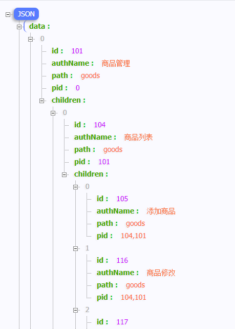

#### 加载当前角色已有权限（默认勾选）

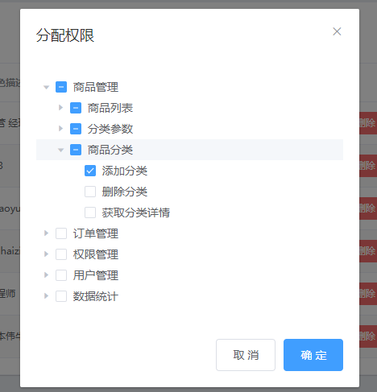

如何实现这样，打开分配权限时已有的权限默认勾选的效果呢？

```vue
<!--树形控件-->
      <el-tree :default-checked-keys="defKeys" ref="treeRef"></el-tree>
```

设置一个default-checked-keys,绑定到已有的权限上，

```js
 data() {
    return {
      //默认选中的节点id值
      defKeys:[],
    };
  },
 methods:{
     //通过递归的形式，获取角色下所有三级权限的id，并保存到defKeys数组中
    getLeafKeys(node,arr){
      //如果当前node节点不包含children属性，则是三级节点
      if(!node.children){
        return arr.push(node.id);
      }
      node.children.forEach(item=>
      this.getLeafKeys(item,arr))
    },
 }
```

在点击分配权限出现对话框的时候就获得该角色的已有权限。

#### 修改用户权限功能

```vue
<el-button type="primary" @click="allotRights">确 定</el-button>
```

```js
//点击为角色分配权限
    async allotRights(){
      const keys = [
        ...this.$refs.treeRef.getCheckedKeys(),
        ...this.$refs.treeRef.getHalfCheckedKeys(),
      ]
      console.log("分配的权限",keys);
      const idStr = keys.join(',')
      const {data:res} = await this.$http.post(`roles/${this.roleId}/rights`,{rids:idStr});
      if(res.meta.status!==200){
        return this.$message.error('分配权限失败！')
      }
      this.$message.success('分配权限成功！')
      this.getRolesList();
      this.setRightDialogVisible = false;
    }
```

点击分配权限弹出对话框时先把角色id保存以供后续使用，然后再点击确定按钮时，获取整个树形结构中的半选/全选数组，进行字符串拼接，发送请求。请求成功刷新列表，关闭分配权限对话框。

### 完成分配角色的功能

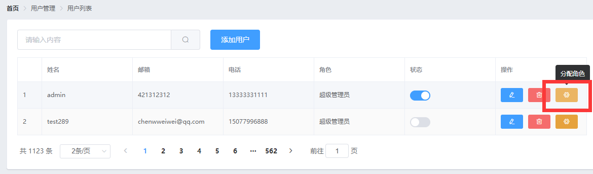

点击分配角色时

```vue
<!--分配角色按钮-->
            <el-tooltip effect="dark" content="分配角色" placement="top-start" :enterable="false">
              <el-button
                type="warning"
                icon="el-icon-setting"
                size="mini"
                @click="setRole(scope.row)"
              ></el-button>
            </el-tooltip>  
```

```js
//展示分配角色的对话框
    async setRole(userInfo) {
      this.userInfo = userInfo;
      //在展示对话框之前，获取所有的角色列表
      const { data: res } = await this.$http.get(`roles`);
      if (res.meta.status !== 200) {
        return this.$message.error("获取角色列表失败！");
      }
      this.rolesList = res.data;
      this.setRoleDialogVisible = true;
    },
```

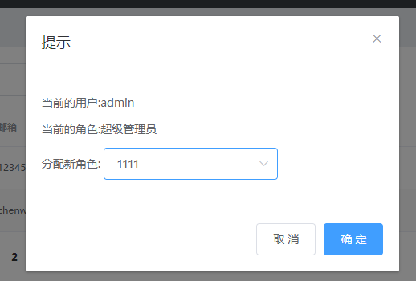

```vue
<!--分配角色的对话框-->
      <el-dialog title="提示" :visible.sync="setRoleDialogVisible" width="30%" @close="setRoleDialogClosed">
        <div>
          <p>当前的用户:{{userInfo.username}}</p>
          <p>当前的角色:{{userInfo.role_name}}</p>
          <p>
            分配新角色:
            <el-select v-model="selectedRoleId" placeholder="请选择">
              <el-option
                v-for="item in rolesList"
                :key="item.id"
                :label="item.roleName"
                :value="item.id"
              ></el-option>
            </el-select>
          </p>
        </div>
        <span slot="footer" class="dialog-footer">
          <el-button @click="setRoleDialogVisible = false">取 消</el-button>
          <el-button type="primary" @click="saveRoleInfo">确 定</el-button>
        </span>
      </el-dialog>
```

在对话框中选择确定后更新该用户的角色

```js
//点击按钮，分配角色
    async saveRoleInfo(){
      if(!this.selectedRoleId){
        return this.$message.error('请选择要分配的角色');
      }
      //console.log("要分配的角色的id",this.selectedRoleId);
      const {data:res} = await this.$http.put(`users/${this.userInfo.id}/role`,{rid:this.selectedRoleId})
      if (res.meta.status !== 200) {
        return this.$message.error("更新角色失败！");
      }
      this.$message.success("更新角色成功！");
      this.getUserList();
      this.setRoleDialogVisible = false;
    },
    //监听分配角色对话框的关闭事件
    setRoleDialogClosed(){
      this.selectedRoleId = '';
      this.userInfo = '';
    }
```

## 6.5 推送权限管理的代码

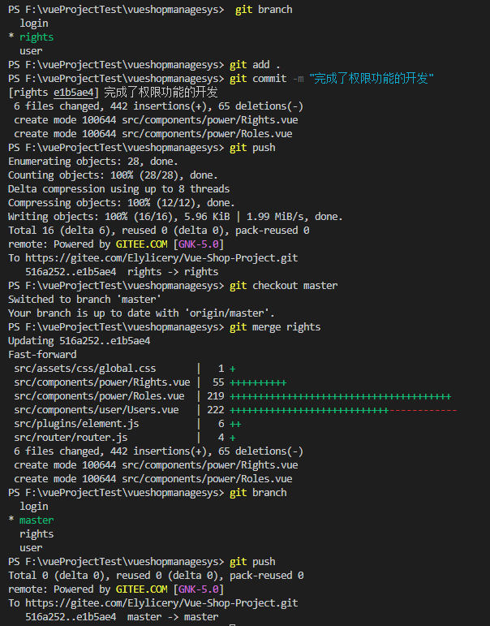

# 7. 分类管理

## 7.1 商品分类功能

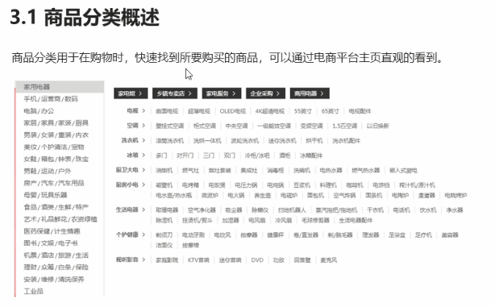


### 创建goods_cate子分值并推送

```
git checkout -b goods_cate
git push -u origin goods_cate
```

## 7.2 商品分类页面

### 使用vue-table-with-tree树形表格组件

地址：https://github.com/MisterTaki/vue-table-with-tree-grid

直接使用

### 使用自定义模板渲染表格数据

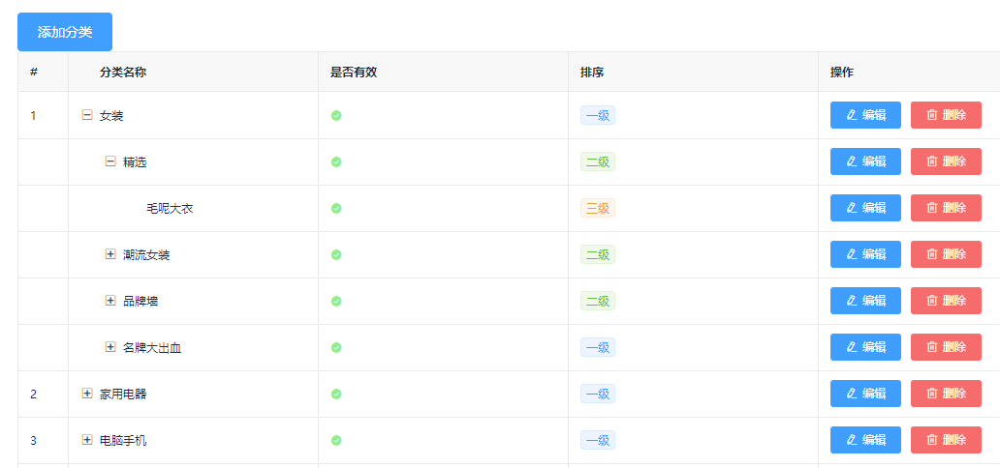

```vue
  <!--商品分类表格-->
      <tree-table :data="cateList" :columns="columns" :selection-type="false" :expand-type="false" show-index index-text="#" border>
        <!--是否有效-->
        <template slot="isok" slot-scope="scope">
          <i class="el-icon-success" v-if="scope.row.cat_deleted === false" style="color:lightgreen"></i>
          <i class="el-icon-error" v-else style="color:lightgreen"></i>
        </template>
        <!--排序-->
        <template slot="order" slot-scope="scope">
          <el-tag size="mini" v-if="scope.row.cat_level===0">一级</el-tag>
          <el-tag  type="success" size="mini" v-else-if="scope.row.cat_level===1">二级</el-tag>
          <el-tag type="warning" size="mini" v-else>三级</el-tag>
		<template>
        <!--操作-->
        <template slot="opt">
          <el-button type="primary" icon="el-icon-edit" size="mini">编辑</el-button>
          <el-button type="danger" icon="el-icon-delete" size="mini">删除</el-button>
        </template>
</tree-table>
```

对于需要自定义的列，可以使用**插槽**来定义模板，利用v-if和v-else来决定渲染的具体样式。

### 获取列表数据

```js
<script>
export default {
  data(){
    return {
      //查询条件
      queryInfo:{
        type:3,
        pagenum:1,
        pagesize:5
      },
      //商品分类的数据列表，默认为空
      cateList:[],
      //总数据
      total:0,
      //为table指定列的定义
      columns:[
        {
          label:'分类名称',
          prop: 'cat_name'
        },
        {
          label:'是否有效',
          //表示，将当前列定义为模板列
          type:'template',
          //表示当前这一列使用的模板名称
          template:'isok'
        },
        {
          label:'排序',
          type:'template',
          template:'order'
        },
        {
          label:'操作',
          type:'template',
          template:'opt',
        }
      ],
    }
  },
  created() {
    this.getCateList();
  },
  methods:{
    //获取商品分类数据
    async getCateList(){
      const {data:res} = await this.$http.get('categories',{params:this.queryInfo});
      if (res.meta.status !== 200) {
        return this.$message.error("获取商品分类失败！");
      }
      console.log('商品分类信息',res.data);
      //把数据列表赋值给cateList
      this.cateList = res.data.result;
      //为总数据条数赋值
      this.total = res.data.total;
    }
  }
}
</script>
```

### 实现分页功能

```vue
<!--分页区-->
      <el-pagination
      @size-change="handleSizeChange"
      @current-change="handleCurrentChange"
      :current-page="queryInfo.pagenum"
      :page-sizes="[5, 10, 25, 20]"
      :page-size="queryInfo.pagesize"
      layout="total, sizes, prev, pager, next, jumper"
      :total="total">
      </el-pagination>
```

### 添加分类的对话框和表单

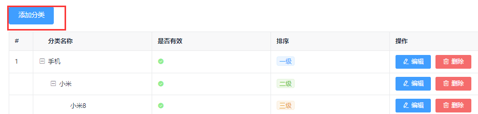

```vue
 <el-button type="primary" @click="showAddCateDialog">添加分类</el-button>
```

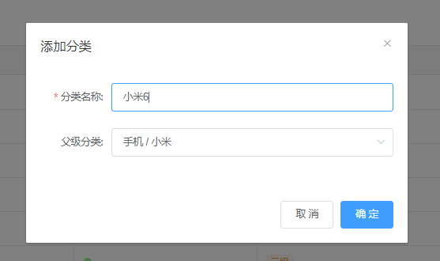

```vue
<!--添加分类的对话框-->
    <el-dialog title="添加分类" :visible.sync="addCatedialogVisible" width="50%" @close="addCateDialogClosed">
      <!--添加分类的表单-->
      <el-form
        :model="addCateForm"
        :rules="addCateFormRules"
        ref="addCateFormRef"
        label-width="100px"
      >
        <el-form-item label="分类名称:" prop="cat_name">
          <el-input v-model="addCateForm.cat_name"></el-input>
        </el-form-item>
        <el-form-item label="父级分类:">
          <!--options指定数据源-->
          <!--props 用来指定配置对象-->
          <el-cascader
            expand-trigger="hover"
            :options="ParentCateList"
            :props="cascaderProps"
            v-model="selectedKeys"
            @change="parentCateChanged"
            clearable 
            :change-on-select="true"
          ></el-cascader>
        </el-form-item>
      </el-form>
      <span slot="footer" class="dialog-footer">
        <el-button @click="addCatedialogVisible = false">取 消</el-button>
        <el-button type="primary" @click="addCate">确 定</el-button>
      </span>
    </el-dialog>
```

### 渲染级联选择器

```vue
<!--options指定数据源-->
          <!--props 用来指定配置对象-->
          <el-cascader
            expand-trigger="hover"
            :options="ParentCateList"
            :props="cascaderProps"
            v-model="selectedKeys"
            @change="parentCateChanged"
            clearable 
            :change-on-select="true"
          ></el-cascader>
```

data:

```js
      //控制添加分类对话框的显示与隐藏
      addCatedialogVisible: false,
      //添加分类的表单数据对象
      addCateForm: {
        //将要添加的分类的名称
        cat_name: "",
        //父级分类的id
        cat_pid: 0,
        //分类的等级，默认要添加的是1级分类
        cat_level: 0
      },
      //添加分类表单的验证规则对象
      addCateFormRules: {
        cat_name: [
          { required: true, message: "请输入分类名称", trigger: "blur" }
        ]
      },
      //父级分类的列表
      ParentCateList: [],
      //指定级联选择器的配置对象
      cascaderProps:{
        value:'cat_id',
        label:'cat_name',
        children:'children',
      },
      //选中的父级分类的id数组
      selectedKeys:[]
```

methods

```js
//点击按钮，展示添加分类的对话框
    showAddCateDialog() {
      //先获取父级分类的数据列表
      this.getParentCateList();
      //在展示出对话框
      this.addCatedialogVisible = true;
    },
    //获取父级分类的数据列表
    async getParentCateList() {
      const { data: res } = await this.$http.get("categories", {
        params: { type: 2 }
      });
      if (res.meta.status !== 200) {
        return this.$message.error("获取父级分类数据失败！");
      }
      console.log("父级分类数据", res.data);
      this.ParentCateList = res.data;
    },
    //选择项发生变化触发这个函数
    parentCateChanged(){
      //如果selectedKeys数组中的length>0 证明选中的父级分类
      //反之，就说明没有选中任何父级分类
      if(this.selectedKeys.length>0){
        //父级分类的id
        this.addCateForm.cat_pid = this.selectedKeys[this.selectedKeys.length-1];
        //为当前分类的等级赋值
        this.addCateForm.cat_level = this.selectedKeys.length;
        return;
       }else{
        this.addCateForm.cat_pid = 0;
        //为当前分类的等级赋值
        this.addCateForm.cat_level = 0;
       }
    },
    //点击按钮，添加新的分类
    addCate(){
      console.log("添加的分类的:",this.addCateForm);
      this.$refs.addCateFormRef.validate(async valid=>{
        if(!valid) return;
        const {data:res} = await this.$http.post('categories',this.addCateForm);
        if (res.meta.status !== 201) {
          return this.$message.error("添加商品分类失败！");
        }
        this.$message.success("添加分类成功！");
        this.getCateList();
        this.addCatedialogVisible = false;
      })
    },
    //监听对话框的关闭事件，重置表单数据
    addCateDialogClosed(){
      this.$refs.addCateFormRef.resetFields();
      this.selectedKeys = [];
      this.addCateForm.cat_level = 0;
      this.addCateForm.cat_pid = 0;
    },
```

### 提交goods_cate分支

切换到`goods_cate`分支

查看工作区状态

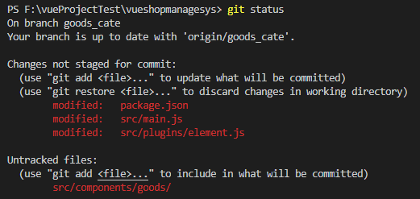

添加文件


再次查看工作区状态

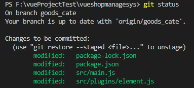

提交到现在的修改

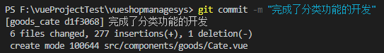

查看工作区状态

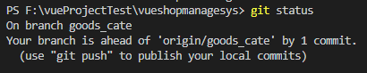

提交`goods_cate`分支修改到远程`goods_cate`分支

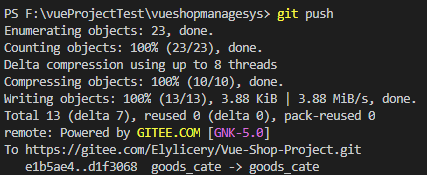

切换到本地master分支并合并`goods_cate`分支

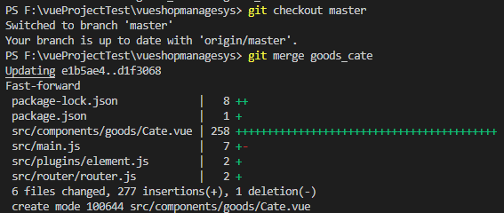

提交本地mster分支到远程master分支

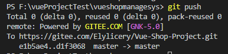

# 8.参数管理

## 8.1 分类参数功能

参数管理概述

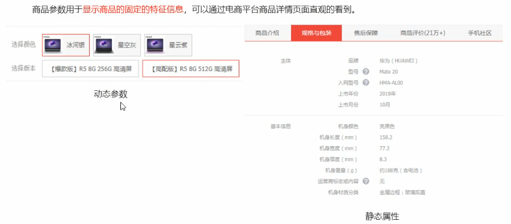

### 创建goods_params分支

创建新分支

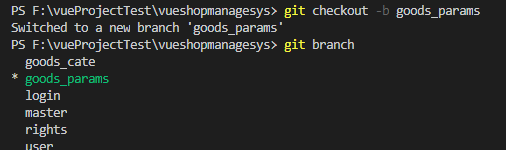

在远程创建新分支

第一次创建加上`-u`参数

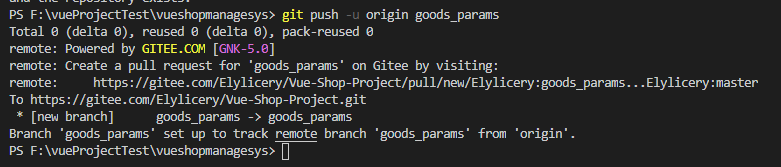

## 8.2 分类参数页面

### 商品分类级联选择器

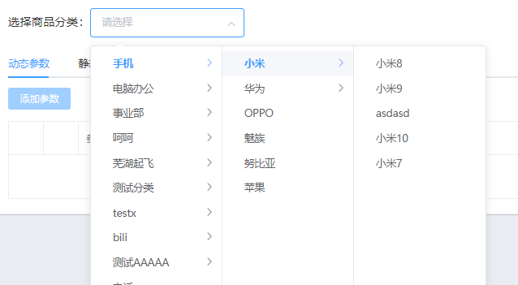

```vue
<!--选择商品分类区域-->
      <el-row class="cat_opt">
        <el-col>
          <span>选择商品分类：</span>
          <!--选择商品分类的级联选择框-->
          <el-cascader
            expand-trigger="hover"
            :options="cateList"
            :props="cateProps"
            v-model="selectedCateKeys"
            @change="handleChange"
          ></el-cascader>
        </el-col>
      </el-row>
```

```js
<script>
export default {
  data() {
    return {
      //商品分类列表
      cateList: [],
      //级联选择框的配置对象
      cateProps:{
        value:'cat_id',
        label:'cat_name',
        children:'children',
      },
      //级联选择框双向绑定到的数组
      selectedCateKeys:[],
    };
  },
  created() {
    this.getCateList();
  },
  methods: {
    //获取所有的商品分类列表
    async getCateList() {
      const { data: res } = await this.$http.get("categories");
      if (res.meta.status !== 200) {
        return this.$message.error("获取商品分类失败！");
      }
      this.cateList = res.data;
      console.log("商品分类", this.cateList);
    },
    //级联选择框选中项变化，会触发这个函数
    handleChange(){
      //证明选中的不是三级分类
      if(this.selectedCateKeys.length!==3){
        this.selectedCateKeys = [];
        return;
      }
      //证明选中的是三级分类
      console.log(this.selectedCateKeys);
    }
  }
};
</script>
```

#### 控制级联选择器的选中范围

因为只能为第三及分类设置相关参数，通过判断选中的数组`selectedKeys`的数组长度来判断选中的是不是三级分类，如果不是直接返回，并清空选择的数组（如上）

### 分类参数的Tabs页签

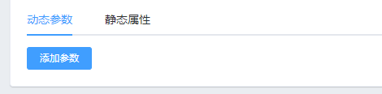

```vue
<!--tab页签区域-->
      <el-tabs v-model="activeName" @tab-click="handleClick">
        <!--添加动态参数的面板-->
        <el-tab-pane label="动态参数" name="many">
          <!--添加参数的按钮-->
          <el-button type="primary" size="mini" :disabled="isBtnDisabled">添加参数</el-button>
        </el-tab-pane> 
        <!--添加静态属性的面板-->
        <el-tab-pane label="静态属性" name="only">
          <!--添加属性的按钮-->
          <el-button type="primary" size="mini" :disabled="isBtnDisabled">添加属性</el-button>
        </el-tab-pane>
      </el-tabs>
```

### 获取参数列表数据

```js
<script>
export default {
  data() {
    return {
      //级联选择框双向绑定到的数组
      selectedCateKeys: [],
      //被激活的页签的名称
      activeName:'many'
    };
  },
  created() {
    this.getCateList();
  },
  methods: {
    //tab 页签点击事件的处理函数
    handleClick(){
      console.log(this.activeName);
      this.getParamsData();
    },
    //获取参数的列表数据
    async getParamsData(){
      //证明选中的不是三级分类
      if (this.selectedCateKeys.length !== 3) {
        this.selectedCateKeys = [];
        return;
      }
      //证明选中的是三级分类
      console.log(this.selectedCateKeys);
      //根据所选分类的id，和当前所处的面板，获取对应的参数
      const {data:res} = await this.$http.get(`categories/${this.cateId}/attributes`,{
        params:{sel:this.activeName}
      });
      if (res.meta.status !== 200) {
        return this.$message.error("获取参数列表失败！");
      }
      console.log(res.data);
    }
  },
  computed:{
    //如果按钮需要被禁用，则返回true，否则返回false
    isBtnDisabled(){
      if(this.selectedCateKeys.length!==3){
        return true;
      }
      return false;
    },
    //当前选中的三级分类的ID
    cateId(){
      if(this.selectedCateKeys.length === 3){
        return this.selectedCateKeys[2];
      }
      return null;
    }
  }
};
</script>
```

上述代码中，当选中的不是三级分类时，不选中，并且禁用添加参数/属性按钮

### 切换Tabs面板后重新获取参数列表

将请求API获取参数列表的代码封装进`getParamsData`函数，在级联选择器变化，和tab页签点击时，都进行调用

### 将获取到的参数数据挂载到不同的数据源上

在data中定义

```js
      //动态参数的数据
      manyTableData:[],
      //静态属性的数据
      onlyTableData:[],
```

在获取参数的列表数据时绑定不同的数据源

```js
const {data:res} = await this.$http.get(`categories/${this.cateId}/attributes`,{
        params:{sel:this.activeName}
      });
      if (res.meta.status !== 200) {
        return this.$message.error("获取参数列表失败！");
      }
      if(this.activeName == 'many'){
        this.manyTableData = res.data;
        console.log("动态参数:",this.manyTableData);
      }else{
        this.onlyTableData = res.data;
        console.log("静态参数",this.onlyTableData);
      }
```

### 渲染动态参数和静态属性的table表格


```vue
<!--tab页签区域-->
      <el-tabs v-model="activeName" @tab-click="handleClick">
        <!--添加动态参数的面板-->
        <el-tab-pane label="动态参数" name="many">
          <!--添加参数的按钮-->
          <el-button type="primary" size="mini" :disabled="isBtnDisabled">添加参数</el-button>
          <!--动态参数表格-->
          <el-table :data="manyTableData" border stripe>
            <!--展开行-->
            <el-table-column type="expand"></el-table-column>
            <!--索引列-->
            <el-table-column type="index"></el-table-column>
            <el-table-column label="参数名称" prop="attr_name"></el-table-column>
            <el-table-column label="操作">
              <template slot-scope="scope">
                <el-button type="primary" icon="el-icon-edit" size="mini">编辑</el-button>
                <el-button type="danger" icon="el-icon-delete" size="mini">删除</el-button>
              </template>
            </el-table-column>
          </el-table>
        </el-tab-pane> 
        <!--添加静态属性的面板-->
        <el-tab-pane label="静态属性" name="only">
          <!--添加属性的按钮-->
          <el-button type="primary" size="mini" :disabled="isBtnDisabled">添加属性</el-button>
          <!--静态属性表格-->
          <el-table :data="onlyTableData" border stripe>
            <!--展开行-->
            <el-table-column type="expand"></el-table-column>
            <!--索引列-->
            <el-table-column type="index"></el-table-column>
            <el-table-column label="属性名称" prop="attr_name"></el-table-column>
            <el-table-column label="操作">
              <template slot-scope="scope">
                <el-button type="primary" icon="el-icon-edit" size="mini">编辑</el-button>
                <el-button type="danger" icon="el-icon-delete" size="mini">删除</el-button>
              </template>
            </el-table-column>
          </el-table>
        </el-tab-pane>
      </el-tabs>
```

## 8.3 添加参数


```vue
 <!--添加参数的对话框-->
    <el-dialog :title="'添加'+titleText" :visible.sync="addDialogVisible" width="50%" @close="addDialogClosed">
      <!--添加参数的对话框-->
      <el-form :model="addForm" :rules="addFormRules" ref="addFormRef" label-width="100px">
        <el-form-item :label="titleText" prop="attr_name">
          <el-input v-model="addForm.attr_name"></el-input>
        </el-form-item>
      </el-form>
        <el-button @click="addDialogVisible = false">取 消</el-button>
        <el-button type="primary" @click="addParams">确 定</el-button>
    </el-dialog>

```

```js
<script>
export default {
  data() {
    return {
      //被激活的页签的名称
      activeName: "many", //默认值动态参数
      //控制添加对话框的显示与隐藏
      addDialogVisible:false,
      //添加参数的表单数据对象
      addForm:{
        attr_name:'',
      },
      //添加表单的验证规则对象
      addFormRules:{
        attr_name:[
          {required:true,message:'请输入参数属性',trigger:'blur'},
        ]
      }
    };
  },
  methods: {
    //监听添加对话框的关闭事件
    addDialogClosed(){
      this.$refs.addFormRef.resetFields();
    },
    //点击按钮，添加参数
    addParams(){
      this.$refs.addFormRef.validate(async valid =>{
        if(!valid) return;
         const {data:res} = await this.$http.post(`categories/${this.cateId}/attributes`,{
          attr_name:this.addForm.attr_name,
          attr_sel:this.activeName
        })
        if (res.meta.status !== 201) {
        return this.$message.error("添加参数失败！");
      }
      this.$message.success("添加参数成功");
      this.addDialogVisible = false;
      this.getParamsData();
      })
    }
  },
  computed: {
    //当前选中的三级分类的ID
    cateId() {
      if (this.selectedCateKeys.length === 3) {
        return this.selectedCateKeys[2];
      }
      return null;
    },
    //动态计算标题的文本
    titleText(){
      if(this.activeName=="many"){
        return '动态参数'
      }else{
        return '静态属性'
      }
    }
  }
};
</script>
```

## 8.4 修改参数

```vue
<el-button type="primary" icon="el-icon-edit" size="mini" @click="showEditDialog(scope.row.attr_id)">编辑</el-button>
```


```vue
<!--修改参数的对话框-->
    <el-dialog
      :title="'修改'+titleText"
      :visible.sync="editDialogVisible"
      width="50%"
      @close="editDialogClosed"
    >
      <!--添加参数的对话框-->
      <el-form :model="editForm" :rules="editFormRules" ref="editFormRef" label-width="100px">
        <el-form-item :label="titleText" prop="attr_name">
          <el-input v-model="editForm.attr_name"></el-input>
        </el-form-item>
      </el-form>
      <el-button @click="editDialogVisible = false">取 消</el-button>
      <el-button type="primary" @click="editParams">确 定</el-button>
    </el-dialog>
```

```js
//点击按钮，展示修改的对话框
    async showEditDialog(attr_id){
      //查询当前参数的信息
      const {data:res} = await this.$http.get(`categories/${this.cateId}/attributes/${attr_id}`,
      {
        params:{attr_sel:this.activeName}
      })
      if (res.meta.status !== 200) {
        return this.$message.error("获取参数信息失败！");
      }
      this.editForm = res.data;
      console.log("当前参数信息",this.editForm);
      this.editDialogVisible = true;
    },
        
    //重置修改的表单
    editDialogClosed(){
      this.$refs.editFormRef.resetFields()
    },
    //点击按钮，修改参数信息
    editParams(){
       this.$refs.editFormRef.validate(async valid
       => {
         if(!valid) return;
         const {data:res} = await this.$http.put(`categories/${this.cateId}/attributes/${this.editForm.attr_id}`,{attr_name:this.editForm.attr_name,attr_sel:this.activeName})

        if (res.meta.status !== 200) {
          return this.$message.error("修改参数失败！");
        }

        return this.$message.success("修改参数成功！");
        this.getParamsData();
        this.editDialogVisible = false;
       });
    },
```


## 8.5 删除参数


```vue
<el-button type="danger" icon="el-icon-delete" size="mini" @click="removeParams(scope.row.attr_id)">删除</el-button>
```

```js
//根据id删除对应的参数项
    async removeParams(attr_id){
      console.log("准备删除该参数！");
      const confirmResult = await this.$confirm('此操作将永久删除该参数, 是否继续?', '提示', 
        {
          confirmButtonText: '确定',
          cancelButtonText: '取消',
          type: 'warning'
        }
      ).catch(err => err);
      //用户取消了删除的操作
      if(confirmResult!=='confirm'){
        return this.$message.info('已取消删除!');
      }
      //删除的业务逻辑
      const {data:res} = await this.$http.delete(`categories/${this.cateId}/attributes/${attr_id}`);
      
      if (res.meta.status !== 200) {
        return this.$message.error("删除参数失败！");
      }
      this.$message.success('删除参数成功！');
      this.getParamsData();
    },
```

## 8.5 分类参数页面修正

### 展开行显示具体参数值增删


#### 动态编辑标签

```vue
<!--动态参数表格-->
          <el-table :data="manyTableData" border stripe>
            <!--展开行-->
            <el-table-column type="expand">
              <template slot-scope="scope">
                <!--循环渲染Tag标签-->
                <el-tag v-for="(item,index) in scope.row.attr_vals" :key="index" closable @close="handleClose(index,scope.row)">{{item}}</el-tag>
                <!--输入的文本框-->
                <el-input
                  class="input-new-tag"
                  v-if="scope.row.inputVisible"
                  v-model="scope.row.inputValue"
                  ref="saveTagInput"
                  size="small"
                  @keyup.enter.native="handleInputConfirm(scope.row)"
                  @blur="handleInputConfirm(scope.row)"
                ></el-input>
                <!--添加的按钮-->
                <el-button v-else class="button-new-tag" size="small" @click="showInput(scope.row)">+ New Tag</el-button>
              </template>
            </el-table-column>
            <!--索引列-->
            <el-table-column type="index"></el-table-column>
            <el-table-column label="参数名称" prop="attr_name"></el-table-column>
          </el-table>
```

methods

#### 


```js
//将对attr_vals的操作，保存到数据库
    async saveAttrVals(row){
      const {data:res} = await this.$http.put(`categories/${this.cateId}/attributes/${row.attr_id}`,{
        attr_name:row.attr_name,
        attr_sel:row.attr_sel,
        attr_vals:row.attr_vals.join(' '),
      })
      if(res.meta.status !==200){
        return this.$message.error('修改参数项失败！');
      }
      this.$message.success('修改参数项成功!');
    },
    //文本框失去焦点，或按下了Enter都会触发
    async handleInputConfirm(row){
      if(row.inputValue.trim().length === 0){
        row.inputValue = '';
        row.inputVisible = false;
        return;
      }
      //如果没有return，则证明输入的内容，需要做后续处理
      console.log('ok');
      row.attr_vals.push(row.inputValue.trim());
      row.inputValue = '';
      row.inputVisible = false;
      //需要发起请求，保存这次操作
      this.saveAttrVals(row);
    },
    //点击按钮，展示文本输入框
    showInput(row){
      row.inputVisible = true;
      //让文本框自动获得焦点
      //$nextTick 方法的作用，就是当页面上元素被重新渲染之后，才会执行回调函数中的代码
      this.$nextTick(_=>{
        this.$refs.saveTagInput.$refs.input.focus()
      })
    },
    //删除对应的参数可选项
    handleClose(index,row){
      row.attr_vals.splice(index,1);
      this.saveAttrVals(row)
    },
```

* 为了避免每一行的数据公用data里的inputVaule和inputVisiable（会造成多行同步更改的效果），所以请求API得到数据的时候，要为每一行数据提供自己单独的inputVaule和inputVisiable，在v-for循环时绑定到自己那行数据。

* 注意这里使用了$nextTick！！一个很重要的tip！

* `row.inputValue.trim().length === 0`来判断是不是空的输入
* 如何添加一个参数的值？先将用户输入的值保存至attr_val属性，然后发送put请求，将参数提交到服务器

## 8.6 将本地goods_paramas推送到远端

先推送goods_params分支到远程


切换到master上合并goods_params分支，然后更新远程的master分支


# 9. 商品列表

***

## 9.1 商品列表功能


### 创建good_list分支并推送到码云

1. git checkout -b goods_list
2. git push - u origin goods_list

## 9.2 商品列表页面

页面简单，基本同user页面

### 自定义格式化时间的全局过滤器


当前以毫秒的时间显示，要让他格式化为  形如`1970-01-19 19:15:42`这样的时间。

可以在main.js里设置全局过滤器

```js
//注册全局过滤器
Vue.filter('dateFormat',function(originVal){
  const dt = new Date(originVal);

  const y = dt.getFullYear();
  const m = (dt.getMonth()+1+'').padStart(2,'0');
  const d = (dt.getDate()+'').padStart(2,'0');

  const hh = (dt.getHours() + '').padStart(2,'0');
  const mm = (dt.getMinutes() + '').padStart(2,'0');
  const ss = (dt.getSeconds() + '').padStart(2,'0');

  return `${y}-${m}-${d} ${hh}:${mm}:${ss}`
})
```

解析：`dateFormat`为过滤器的名字，`originVal`为传进来的值，首先将毫秒格式数据转换为Date型数据.`m = (dt.getMonth()+1+'').padStart(2,'0')`获取月份，因为`getMonth()`获取到的月份从0开始，所以要`+1`,然后`+''`将其转为字符串，`padStart(2,'0')`表示如果字符串不足两位则在前面补上0。

然后再template中使用过滤器

```vue
<el-table :data="goodsList" border stripe>
        <el-table-column label="商品名称" prop="goods_name"></el-table-column>
        <el-table-column label="创建时间" prop="add_time" width="140px">
          <template slot-scope="scope">
            {{scope.row.add_time | dateFormat}}
          </template>
        </el-table-column>
      </el-table>
```

显示效果：


### 通过编程式导航跳转到添加商品页面


点击添加页面后进入商品添加页面，如下

```vue
<el-button type="primary" @click="goAddpage">添加商品</el-button>
```

methods中

```js
//进入添加商品页面组件
    goAddpage(){
      this.$router.push('/goods/add');
    }
```

这里跳转到路由`/good/add`，所以需要配置该路由指向的页面组件

在router.js中

```js
import Add from '../components/goods/Add.vue'

const router = new Router({
  routes:[
    { path:'/',redirect:'/login'},
    { path:'/login',component:Login},
    { path:'/home',
      component:Home,
      redirect:'/welcome',
      children:[
        { path:'/goods',component:GoodsList},
        { path:'/goods/add',component:Add},//加入该组件路由
    ]}
  ]
})
```

## 9.3 商品添加页面


### 渲染添加页面的结构

#### 步骤条组件

```vue
<!--步骤条区域-->
      <el-steps :space="200" :active="activeIndex -0" finish-status="success" align-center>
        <el-step title="基本信息"></el-step>
        <el-step title="商品参数"></el-step>
        <el-step title="商品属性"></el-step>
        <el-step title="商品图片"></el-step>
        <el-step title="商品内容"></el-step>
        <el-step title="完成"></el-step>
      </el-steps>
```

#### tab栏区域

```vue
     <!--tab栏区域-->
      <el-form
        :model="addForm"
        :rules="addFormRules"
        ref="addFormRef"
        label-width="100px"
        label-position="top"
        class="demo-ruleForm"
      >
        <el-tabs
          :tab-position="'left'"
          v-model="activeIndex"
          :before-leave="beforeTabLeave"
          @tab-click="tabClicked"
        >
          <el-tab-pane label="基本信息" name="0">
            <el-form-item label="商品名称" prop="goods_name">
              <el-input v-model="addForm.goods_name"></el-input>
            </el-form-item>
            <el-form-item label="商品价格" prop="goods_price">
              <el-input v-model="addForm.goods_price" type="number"></el-input>
            </el-form-item>
            <el-form-item label="商品重量" prop="goods_weight">
              <el-input v-model="addForm.goods_weight" type="number"></el-input>
            </el-form-item>
            <el-form-item label="商品数量" prop="goods_number">
              <el-input v-model="addForm.goods_price" type="number"></el-input>
            </el-form-item>
            <el-form-item label="商品分类" prop="goods_cat">
              <el-cascader
                expand-trigger="hover"
                :options="cateList"
                :props="cateProps"
                v-model="addForm.goods_cat"
                @change="handleChange"
              ></el-cascader>
            </el-form-item>
          </el-tab-pane>
          <el-tab-pane label="商品参数" name="1">
            <!--渲染表单的Item项-->
            <el-form-item :label="item.attr_name" v-for="item in manyTableData" :key="item.attr_id">
              <!--复选框组-->
              <el-checkbox-group v-model="item.attr_vals">
                <el-checkbox :label="cb" v-for="(cb,i) in item.attr_vals" :key="i" border></el-checkbox>
              </el-checkbox-group>
            </el-form-item>
          </el-tab-pane>
          <el-tab-pane label="商品属性" name="2">
            <el-form-item :label="item.attr_name" v-for="item in onlyTableData" :key="item.attr_id">
              <el-input v-model="item.attr_vals"></el-input>
            </el-form-item>
          </el-tab-pane>
          <el-tab-pane label="商品图片" name="3">
            <!--action 表示图片要上传到的后台API地址-->
            <el-upload :action="uploadURL" :on-preview="handlePreview"
              :on-remove="handleRemove" :headers="headerObj" :on-success="handleSuccess"
              list-type="picture">
              <el-button size="small" type="primary">点击上传</el-button>
            </el-upload>
          </el-tab-pane>
          <el-tab-pane label="商品内容" name="4">定时任务补偿</el-tab-pane>
        </el-tabs>
      </el-form>
```

### 9.3.1 基本信息

#### 实现步骤条和tab栏的数据联动效果

data中定义变量`activeIndex: "0"`，表示步骤条默认激活哪一条

```vue
<el-steps :space="200" :active="activeIndex -0" finish-status="success" align-center>
```

注意：active绑定的是number值，所以这里`activeIndex -0`是将其string转为number。

```vue
<el-tabs  :tab-position="'left'" v-model="activeIndex" :before-leave="beforeTabLeave" @tab-click="tabClicked">
```

让步骤条和tab所共同绑定一个值`activeIndex`就可以了

在**切换tab时**监听事件，获取不同的数据

methods中：

```js
//监听页签切换事件
    async tabClicked() {
      //console.log(this.activeIndex);//打印页签对应的name名称
      //证明访问的是动态参数面板
      if (this.activeIndex === "1") {
        console.log("动态参数面板");
        const { data: res } = await this.$http.get(
          `categories/${this.cateId}/attributes`,
          {
            params: { sel: "many" }
          }
        );

        if (res.meta.status !== 200) {
          return this.$message.error("获取动态参数列表失败！");
        }

        console.log("动态参数列表数据", res.data);
        res.data.forEach(item => {
          item.attr_vals =
            item.attr_vals.length === 0 ? [] : item.attr_vals.split(" ");
        });
        this.manyTableData = res.data;
      }
      //访问的是静态属性面板
      else if (this.activeIndex === "2") {
        const { data: res } = await this.$http.get(
          `categories/${this.cateId}/attributes`,
          {
            params: { sel: "only" }
          }
        );

        if (res.meta.status !== 200) {
          return this.$message.error("获取静态属性失败！");
        }
        console.log(res.data);
        this.onlyTableData = res.data;
      }
    },
```

#### 分析表单的组成部分

因为`el-tab-pane`只能是`el-tabs`的子标签，所以把`el-form`放在最外面，包裹整个`el-tabs`

```vue
<el-form :model="addForm" :rules="addFormRules" ref="addFormRef" label-width="100px" label-position="top" >
        <el-tabs :tab-position="'left'" v-model="activeIndex" :before-leave="beforeTabLeave" @tab-click="tabClicked"
        >
          <el-tab-pane label="基本信息" name="0">
            <el-form-item label="商品名称" prop="goods_name">
              <el-input v-model="addForm.goods_name"></el-input>
            </el-form-item>
            <el-form-item label="商品价格" prop="goods_price">
              <el-input v-model="addForm.goods_price" type="number"></el-input>
            </el-form-item>
          </el-tab-pane>         
        </el-tabs>
      </el-form>
```

### 9.3.2  商品参数

#### 阻止页签切换


如果所选的商品分类不是三级标签，如何阻止页签变化？

如何**监听标签页的切换行为** `before-leave`

```vue
<el-tabs :tab-position="'left'" v-model="activeIndex" :before-leave="beforeTabLeave">
```

methods

```js
    beforeTabLeave(activeName,oldActiveName){
      //console.log("即将离开的标签页:",oldActiveName,"即将进入的标签页：",activeName);
      if(oldActiveName === '0' && this.addForm.goods_cat.length !==3){
        this.$message.error('请先选择商品分类！');
        return false;
      }
    }
```

#### 商品参数面板中的复选框

选择商品分类后，根据分类的id，获取其对应的动态参数


在页签切换时就获取动态参数列表数据，赋值给data里的`manyTableData`,使用其渲染复选框组

```vue
<el-tab-pane label="商品参数" name="1">
            <!--渲染表单的Item项-->
            <el-form-item :label="item.attr_name" v-for="item in manyTableData" :key="item.attr_id">
              <!--复选框组-->
              <el-checkbox-group v-model="item.attr_vals">
                <el-checkbox :label="cb" v-for="(cb,i) in item.attr_vals" :key="i" border></el-checkbox>
              </el-checkbox-group>
            </el-form-item>
          </el-tab-pane>
```

### 9.3.3 商品属性

在页签切换时就获取静态参数列表数据，赋值给data里的`onlyTableData`,使用其渲染表单


```vue
          <el-tab-pane label="商品属性" name="2">
            <el-form-item :label="item.attr_name" v-for="item in onlyTableData" :key="item.attr_id">
              <el-input v-model="item.attr_vals"></el-input>
            </el-form-item>
          </el-tab-pane>
```

### 9.3.4 商品图片

#### upload图片组件


```vue
 <el-tab-pane label="商品图片" name="3">
            <!--action 表示图片要上传到的后台API地址-->
            <el-upload :action="uploadURL" :on-preview="handlePreview"
              :on-remove="handleRemove" :headers="headerObj" :on-success="handleSuccess"
              list-type="picture">
              <el-button size="small" type="primary">点击上传</el-button>
            </el-upload>
          </el-tab-pane>
```

#### 手动为upload组件绑定headers请求头

在图片上传这里，因为直接用action上传，显示的定义`:action:"uploadURL"`，所以在发送请求时，会得到


在本项目中，除了登录接口之外，调用其他任何接口都需要调用时提供token值。

之前我们在main.js通过request拦截器为每个请求都挂在了一个`Authorazation`字段值，这个值就是token，这里提示无效token，是因为使用upload上传组件时没有用到`axios`来发送ajax，所以才报错。（即el-upload使用自己封装的ajax，没有携带`authorazation`值），所以看el-upload中有没有配置项来提供token值？

可以看到`headers`属性，用来设置上传的请求头部

在data中定义

```js
//上传图片的地址
      uploadURL: "http://timemeetyou.com:8889/api/private/v1/el-upload",
      //uploadURL:'https://www.liulongbin.top:8888/api/private/v1/',
      //图片上传组建的headers请求头
      headerObj:{
        Authorization:window.sessionStorage.getItem('token')
      },
```

然后设置`<el-upload :action="uploadURL" :headers="headerObj">`就可以成功上传图片

#### 监听upload的on-success事件

` <el-upload :on-success="handleSuccess"">`

```js
//监听图片上传成功的事件
    handleSuccess(response){
      //console.log(response);
      //1. 拼接得到一个图片信息对象
      const picInfo = {pic:response.data.tmp_path};
      //2. 将图片信息对象，push到pics数组中
      this.addForm.pics.push(picInfo);
 }
```

#### 监听upload的on-remove事件

` <el-upload :on-remove="handleRemove" >`

```js
 //处理移除图片的操作
    handleRemove(file) {
      //console.log(file);
      //1.获取将要删除的图片的临时途径
      const filePath = file.response.data.tmp_path;
      //2.从pics数组中，找到这个图片对应的索引值
      const i = this.addForm.pics.findIndex(x => x.pic === filePath);
      //3.调用数组的splice方法， 把图片信息对象，从pics数组中移除
      this.addForm.pic.splice(i,1);
      console.log(this.addForm);
    },
```

#### 实现图片的预览效果

` <el-upload on-preview="handlePreview">`

在data中定义

```js
  previewPath:'',
  previewVisible:false,
```
```js
    //处理图片预览效果
    handlePreview(file) {
      console.log(file);
      this.previewPath = file.response.data.url;
      this.previewVisible = true;
    },
```

定义的对话框

```vue
    <!--图片预览-->
    <el-dialog title="图片预览" :visible.sync="previewVisible" width="50%">
      
    </el-dialog>
```

### 9.3.4 商品内容

#### 安装并配置vue-quill-editor

首先安装该运行时依赖，在main.js中导入和引用样式及注册

```js
//导入富文本编辑器
import VueQuillEditor from 'vue-quill-editor'

//require styles 导入富文本编辑器对应的样式
import 'quill/dist/quill.core.css' // import styles
import 'quill/dist/quill.snow.css' // for snow theme
import 'quill/dist/quill.bubble.css' // for bubble theme

//将富文本编辑器，注册为全局可用的组件
Vue.use(VueQuillEditor)
```

然后按照文档中SPA的使用方式，使用

```vue
<el-tab-pane label="商品内容" name="4">
            <!--富文本编辑器组件-->
            <quill-editor v-model="addForm.goods_introduce"></quill-editor>
            <!--添加商品的按钮-->
            <el-button type="primary" class="btnAdd" @click="add">添加商品</el-button>
          </el-tab-pane>
```

里面的内容双向绑定到添加表单的good_introduce


#### 实现表单数据的预验证并添加商品

```js
//添加商品
    add(){
      //对整个表单数据进行预验证
      this.$refs.addFormRef.validate( async valid => {
        if(!valid){
          return this.$message.error('请填写必要的表单项');
        }
        //执行添加的业务逻辑
        console.log("完成商品，要正式使用API添加啦！");
        //lodash cloneDeep(obj)进行一次深拷贝
        const form = _.cloneDeep(this.addForm);
        form.goods_cat = this.addForm.goods_cat.join(',');
        //处理动态参数
        this.manyTableData.forEach(item => {
          const newInfo = {attr_id:item.attr_id,attr_value:item.attr_vals.join(' ')};
          this.addForm.attrs.push(newInfo);
        });
        //处理静态属性
        this.onlyTableData.forEach(item => {
          const newInfo = {attr_id:item.attr_id,attr_value:item.attr_vals};
          this.addForm.attrs.push(newInfo);
        });
        form.attrs = this.addForm.attrs;
        console.log("处理过后的form",form);

        //发起请求添加商品
        // 商品的名称，必须是唯一的
        const {data :res} = await this.$http.post('goods',form);

        if(res.meta.status !== 201){
          return this.$message.error('添加商品失败!');
        }
        this.$message.success('添加商品成功!');
        this.$router.push('/goods');
      })
    }
```

### 9.4 推送goods_list分支

1. git checkout goods_list
2. git status
3. git add .
4. git commit -m "完成商品列表功能开发"
5. git push
6. git checkout master
7. git merge goods_list
8. git push

# 10 .订单管理

***

## 10.1 订单列表功能

### 创建order分支并推送

1. git checkout -b order
2. git push -u origin order

## 10.2 订单列表页面

基础页面同之前，包含查询框/表格/分页


### 10.2.1 修改地址对话框


#### 实现省市区县数据联动效果

`import cityData from "./citydata";` 导入citydata.js文件（数据源）

```js
import cityData from "./citydata";

export default {
data() {
    return {
      addressVisible: false,
      addressForm: {
        address1: [],
        address2: ""
      },
      addressFormRules: {
        address1: [
          { required: true, message: "请选择省市区县", trigger: "blur" }
        ],
        address2: [
          { required: true, message: "请填写详细地址", trigger: "blur" }
        ]
      },
      cityData, //属性名与值相同，可以简写
    };
  },
}
```

使用级联选择器实现数据联动效果


```vue
<!-- 修改地址的对话框-->
    <el-dialog title="修改地址" :visible.sync="addressVisible" width="50%" @close="addressDialogClosed">
      <el-form
        :model="addressForm"
        :rules="addressFormRules"
        ref="addressFormRef"
        label-width="150px"
      >
        <el-form-item label="省市区/县" prop="address1">
          <el-cascader :options="cityData" v-model="addressForm.address1"></el-cascader>
        </el-form-item>
        <el-form-item label="详细地址" prop="address2">
          <el-input v-model="addressForm.address2"></el-input>
        </el-form-item>
      </el-form>
      <span slot="footer" class="dialog-footer">
        <el-button @click="addressVisible = false">取 消</el-button>
        <el-button type="primary" @click="addressVisible = false">确 定</el-button>
      </span>
    </el-dialog>
```

### 10.2.2 物流信息查看


### 导入并使用Timeline组件

因为当前项目安装的element-ui版本不是最新版本，所以手动导入timeline组件


然后在element.js中导入

```js
import Timeline from './timeline/index.js'
import TimelineItem from './timeline-item/index.js'

Vue.use(Timeline)
Vue.use(TimelineItem)

```

在页面中使用

```js
data() {
    return {
      cityData, //属性名与值相同，可以简写
      progressVisible: false,
      progressInfo: []
    };
  },
```

显示页面

```vue
 <!--展示物流进度的对话框-->
    <el-dialog title="物流进度" :visible.sync="progressVisible" width="50%">
      <!--timeline时间线-->
      <el-timeline>
        <el-timeline-item
          v-for="(activity, index) in progressInfo"
          :key="index"
          :timestamp="activity.time"
        >{{activity.context}}</el-timeline-item>
      </el-timeline>
    </el-dialog>
```

并在order.Vue中使用懒加载方式引入样式

```css
<style lang="less" scoped>
@import '../../plugins/timeline/timeline.css';
@import '../../plugins/timeline-item/timeline-item.css';
</style>
```

## 10.3 提交order分支

同之前

# 11. 数据统计

***

## 11.1 数据统计功能


### 创建report分支并推送

1. git checkout -b report 
2. git push -u origin report

## 11.2 数据统计页面

### 安装Echarts并渲染Demo图标

1. 安装echarts运行时依赖 并导入`import echarts from "echarts"`
2. 绘制一个简单的图标 [https://echarts.apache.org/zh/tutorial.html#5%20%E5%88%86%E9%92%9F%E4%B8%8A%E6%89%8B%20ECharts](https://echarts.apache.org/zh/tutorial.html#5 分钟上手 ECharts)

### 获取折线图数据并渲染图表

template

```vue
<template>
  <div>
    <!--卡片视图区域-->
    <el-card>
      <!-- 2 .为 ECharts 准备一个具备大小（宽高）的 DOM -->
      <div id="main" style="width: 750px;height:400px;"></div>
    </el-card>
  </div>
</template>
```

script

```js
<script>
//1. 导入echarts
import echarts from "echarts";
import _ from 'lodash'

export default {
  data() {
    return {
      //需要合并的数据
      options: {
        title: {
          text: '用户来源'
        },
        tooltip: {
          trigger: 'axis',
          axisPointer: {
            type: 'cross',
            label: {
              backgroundColor: '#E9EEF3'
            }
          }
        },
        grid: {
          left: '3%',
          right: '4%',
          bottom: '3%',
          containLabel: true
        },
        xAxis: [
          {
            boundaryGap: false
          }
        ],
        yAxis: [
          {
            type: 'value'
          }
        ]
      }
    };
  },
  created() {},
  methods: {},
  //此时，页面上的元素，已经被渲染完毕了！
  async mounted() {
    //3 基于准备好的dom，初始化echarts实例
    var myChart = echarts.init(document.getElementById("main"));
    
    const {data:res } = await this.$http.get('reports/type/1');
    if(res.meta.status !== 200){
      return this.$message.error('获取折线图数据失败！');
    }
    //4 指定图表的配置项和数据
    const result = _.merge(res.data,this.options);//使用lodash的合并函数
    //5.使用刚指定的配置项和数据显示图表。
    myChart.setOption(result);
  }
};
</script>
```

使用API获取折线图数据，为了多出鼠标跟随的效果，可以将options对象粘贴到返回的data中，使用`lodash`的merge将服务器返回的data数据和options合并，将合并的结果交给echarts展示，得到最终效果。

## 11.3 提交report分支

1. git checkout report

2. git status

3. git add .

4. git commit -m "完成了报表功能的开发"

5. git push

6. git checkout master

7. git merge report

8. git push

   

# 12. 项目优化上线

***

### 学习目标

1. 优化VUe项目
2. 部署Vue项目

## 12.1 项目优化

### 12.1. 0  项目优化策略


####  通过ngprogress添加进度条效果


1. 安装运行时依赖 ngprogress(文档 https://github.com/rstacruz/ngprogress

2. 在main.js里导入JS 和csss

3. 配置请求拦截器和响应拦截器

```js
//导入 Npragress包对应的JS和CSS
import NProgress from 'nprogress'
import 'nprogress/nprogress.css'

//在request拦截器中，展示进度条
axios.defaults.baseURL = 'http://timemeetyou.com:8889/api/private/v1/'
axios.interceptors.request.use(config => {
  console.log(config);
  NProgress.start()
  //为请求头对象，添加token认证的Authorization字段
  config.headers.Authorization = window.sessionStorage.getItem('token');
  //最后必须return config
  return config;
})
//在response拦截器中，隐藏进度条NPragress.done()
axios.interceptors.response.use(config => {
  NProgress.done();
  return config;
})
```

#### 解决serve命令中提示的ESlint语法错误

打开vue ui，解决输出的warning


【注】：使用eslint的过程中，可以在.prettierrc文件里更改与vscode格式化代码冲突的配置

#### 在执行build命令期间移除所有的console

产品发布不允许有console，console是用于开发的，所以在项目build期间，不希望打印console

可以配置bubble插件，来移除在项目build期间的所有console

1. 安装运行时依赖**babel-plugin-transform-remove-console**
2. 在babel.config.js中配置

```js
module.exports = {
  presets: [
    '@vue/cli-plugin-babel/preset'
  ],
  plugins: [
    [
      'component',
      {
        libraryName: 'element-ui',
        styleLibraryName: 'theme-chalk'
      }
    ],
    'transform-remove-console'
  ]
}
```

#### 只在发布阶段移除所有的console

上述配置将全局有效，开发和发布时都会移除console，如何只在发布阶段移除所有的console？

运行阶段


发布阶段


在babel.config.js中配置

```js
//这是项目发布阶段需要用到的babel插件
const prodPlugins = []
if(process.env.NODE_ENV === 'production'){
  prodPlugins.push('transform-remove-console')
}

module.exports = {
  presets: [
    '@vue/cli-plugin-babel/preset'
  ],
  plugins: [
    [
      'component',
      {
        libraryName: 'element-ui',
        styleLibraryName: 'theme-chalk'
      }
    ],
    //发布产品时候的插件数组
    ...prodPlugins
  ]
}

```

【注】：`...`代表展开运算符，把数组里的每一项展开了放到另一个数组

这样就可以啦！

###  12.1.1 生成打包报告


能看到哪些依赖项目比较大


那么，如何减小依赖项的体积？


时间比较长，如何优化项目打开速度？


资源体积太大，如何把文件优化得更小？


如何优化比较大的项？

### 12.1.2 通过vue.config.js修改webpack的默认配置


### 12.1.3 为开发模式与发布模式指定不同的打包入口


### 12.1.4  configureWebpack与chainWebpack


### 12.1.5 通过chainWebpack自定义打包入口


### 12.1.6 通过externals加载外部CDN资源


#### externals效果演示


可以看到，打包体积下降明显

### 12.1.7 通过CDN优化ElementUI的打包


没有文件有！号了，说明当前优化有效


### 12.1.8 首页内容定制


### 12.1.9 路由懒加载


安装开发时依赖


```js
//改为懒加载的模式
const Login = () => import(/* webpackChunkName: "login_home_welcome" */ '../components/Login.vue')
const Home = () => import(/* webpackChunkName: "login_home_welcome" */ '../components/Home.vue')
const Welcome = () => import(/* webpackChunkName: "login_home_welcome" */ '../components/Welcome.vue')

const Users = () => import(/* webpackChunkName: "Users_Rights_Roles" */ '../components/user/Users.vue')
const Rights = () => import(/* webpackChunkName: "Users_Rights_Roles" */ '../components/power/Rights.vue')
const Roles = () => import(/* webpackChunkName: "Users_Rights_Roles" */ '../components/power/Roles.vue')
```


## 12.2 项目上线


### 12.2.1 通过node创建web服务器


新建一个文件夹vue-shop-serve

执行 `npm init -y`

再执行 `npm i express -S`

将build后的dist文件夹复制过来


再新建app.js文件配置

```js
const express = require('express')

const app = express()

app.use(express.static('./dist'))

app.listen(80,() => {
  console.log('serve runing at http://127.0.0.1');
})
```


上图说明成功，使用该地址可以正常打开项目


### 12.2.2 开启gzip配置


导入这个包，然后注册为中间件

```js
const express = require('express')
const compression = require('compression')

const app = express()

//一定要把这一行代码，写道静态资源托管之前
app.use(compression())
app.use(express.static('./dist'))

app.listen(80,() => {
  console.log('serve runing at http://127.0.0.1');
})
```

### 12.2.3 配置HTTPS服务


### 12.2.4 使用PM2管理应用


